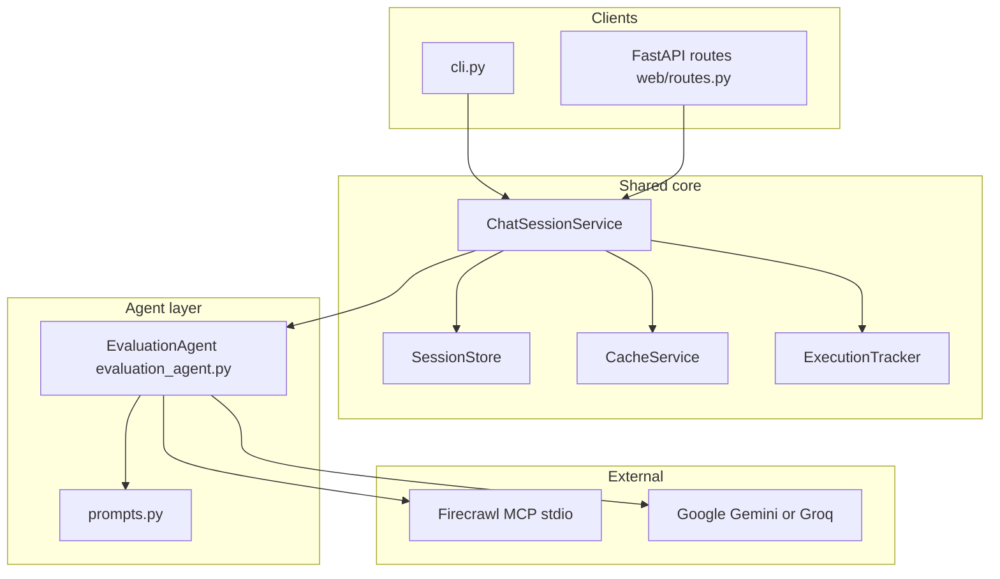

# 🏗️ Architecture Overview

The system exposes **two entry points** that share the same orchestration and agent logic: an **interactive CLI** and an **HTTP JSON API** (FastAPI). Crawling and API keys always run **on the server process**; clients send text/JSON only.

## System Architecture

### Mermaid (high-level)



### ASCII (layered detail)

```
┌──────────────────────────────┐  ┌──────────────────────────────────────┐
│  CLI                         │  │  HTTP API (FastAPI)                  │
│  src/agentic_crawler/cli.py  │  │  src/agentic_crawler/web/            │
│  • Rich UI, slash commands   │  │  app.py (lifespan + MCP), routes.py  │
│  • Session id: "cli"         │  │  • JSON: POST /api/chat, etc.        │
└──────────────┬───────────────┘  └──────────────────┬───────────────────┘
               │                                      │
               └──────────────────┬───────────────────┘
                                  ▼
┌─────────────────────────────────────────────────────────────────────────┐
│  ChatSessionService (services/chat_service.py)                          │
│  • process_turn(session_id, user_text) → TurnResult / tool_events       │
│  • SessionStore: in-memory session_id → message list                    │
│  • asyncio.Lock per session_id                                          │
│  • content_normalize.py: coerce list/multimodal content to string       │
└─────────────────────────────────────────────────────────────────────────┘
               │
               ▼
┌─────────────────────────────────────────────────────────────────────────┐
│  Agent Layer          src/agentic_crawler/agents/                       │
│  EvaluationAgent (evaluation_agent.py) + prompts.py  →  LangChain create_agent │
└─────────────────────────────────────────────────────────────────────────┘
               │
               ▼
┌─────────────────────────────────────────────────────────────────────────┐
│  Service helpers                                                        │
│  cache_service.py  │  tracker_service.py  │  file_utils (save outputs)   │
└─────────────────────────────────────────────────────────────────────────┘
               │
               ▼
┌─────────────────────────────────────────────────────────────────────────┐
│  Data models              src/agentic_crawler/models/                   │
│  execution.py (ToolCall, ExecutionStats, CacheStats)                    │
│  reports.py (report structures)                                         │
│  Pydantic: TurnResult, ToolEvent (in chat_service)                      │
└─────────────────────────────────────────────────────────────────────────┘
               │
               ▼
┌─────────────────────────────────────────────────────────────────────────┐
│  Utils & config                                                         │
│  utils/: file_utils, display_utils, mcp_utils  │  config/settings.py     │
│  CORS_ORIGINS for HTTP; get_config / .env                               │
└─────────────────────────────────────────────────────────────────────────┘
               │
               ▼
┌─────────────────────────────────────────────────────────────────────────┐
│  External                                                               │
│  Firecrawl MCP (stdio, Node/npx)  │  Google AI (Gemini)  │  Groq       │
└─────────────────────────────────────────────────────────────────────────┘
```

**MCP lifecycle:** Each running process (CLI session or uvicorn worker) holds **one** stdio MCP connection for the lifetime of that process—CLI via `stdio_client` in `cli.run()`, API via FastAPI `lifespan` in `web/app.py`. Multi-worker deployments would need an MCP strategy per worker; not assumed here.

**API contract:** Full request/response schemas are available at **`/docs`** (OpenAPI) when the server is running—do not duplicate them in this document.

## Data Flow

### 1. User Query Flow

Both **CLI** and **HTTP** paths converge on `ChatSessionService.process_turn` (after MCP + `EvaluationAgent` are initialized).

**CLI path**

```
User input (terminal)
    │
    ▼
cli.py — slash command?
    │
    ├─► /stats, /clear, /reports, /outputs, /help → helpers + Rich display
    │
    └─► Natural language query
            │
            ▼
    ChatSessionService.process_turn(session_id="cli", user_text)
            │
            ├─► (same agent/cache/tracker/save logic as API — see below)
            │
            └─► TurnResult + agent_messages
                    │
                    └─► Rich: _display_interleaved_trace, display_response
```

**HTTP path**

```
POST /api/chat { "message", "session_id?" }
    │
    ▼
SessionStore.ensure_session → UUID if omitted
    │
    ▼
ChatSessionService.process_turn(session_id, message)
    │
    └─► JSON: { "session_id", "assistant_text", "tool_events", "error?", "report_saved_path?" }
```

**Shared turn logic (inside `ChatSessionService`)**

```
Append user message to SessionStore for this session_id
    │
    ▼
EvaluationAgent.ainvoke(messages)
    │
    ├─► Per tool call: CacheService get/put (put stores normalized text only)
    ├─► ToolMessage content may be str or list (multimodal blocks)
    │       → normalize_langchain_content() before cache, file save, JSON API
    │
    ├─► ExecutionTracker (tokens, cost, tool stats)
    ├─► Optional save: tool_outputs/, reports/ via file_utils
    │
    └─► Final assistant content (normalized) → TurnResult; history updated
```

**Response shape:** Markdown text (website summary, Mermaid sitemap/user-flow diagrams, etc.). The MVP API does **not** stream tokens; `POST /api/chat` returns when the full turn completes (can be slow for large crawls).

### 1b. Content normalization

LangChain / some providers may return **list-shaped** message content instead of a plain string. The project normalizes this in `services/content_normalize.py` and uses it in `chat_service` and `cache_service.put` so caching and persistence never call `.encode()` on a list.

### 2. Cache Flow

```
Tool Call Request
    │
    ▼
Cache Service
    │
    ├─► Generate Cache Key (MD5 hash of tool + args)
    │
    ├─► Check if exists
    │       │
    │       ├─► YES: Check TTL
    │       │       │
    │       │       ├─► Valid? ─► Return Cached Result
    │       │       └─► Expired? ─► Remove & Continue
    │       │
    │       └─► NO: Continue
    │
    ├─► Execute Tool Call
    │
    ├─► Store Result (string; multimodal output normalized first)
    │       │
    │       ├─► Check Size Limits
    │       └─► Evict Old Entries (LRU)
    │
    └─► Return Result
```

## Component Responsibilities

### HTTP / Web layer (`web/`)

| File | Role |
|------|------|
| `app.py` | FastAPI app, `lifespan` context: stdio MCP client → `load_mcp_tools` → `EvaluationAgent`, `ChatSessionService`, `app.state` |
| `routes.py` | REST: `POST /api/chat`, `POST /api/session/clear`, `GET /api/reports`, `GET /api/outputs`, `GET /api/stats`, `GET /api/health` |
| `main.py` | uvicorn entry (`agentic-crawler-web` console script) |

**CORS:** `CORSMiddleware` reads `CORS_ORIGINS` from [config/settings.py](src/agentic_crawler/config/settings.py) (comma-separated origins, or `*` for permissive dev).

**Dependencies:** `ChatSessionService`, config, file listing helpers.

### CLI (`cli.py`)

**Responsibilities:** MCP startup loop, `ChatSessionService` wiring (fixed `session_id="cli"`), slash commands, Rich display. Delegates each query to `process_turn`; replays tool trace via `_display_interleaved_trace` using `agent_messages` + `tool_events` for correct ordering.

**Dependencies:** Same services as API; `display_utils` (no service imports at module top to avoid circular imports).

### ChatSessionService (`services/chat_service.py`)

**Responsibilities:** Single place for `ainvoke`, cache/tracker/save, `SessionStore`, per-session locks, `TurnResult` / `ToolEvent` DTOs. No Rich or HTTP.

**Dependencies:** `EvaluationAgent`, `CacheService`, `ExecutionTracker`, `Config`, `content_normalize`, `file_utils`.

### Agent Layer (`agents/`)

**Responsibilities:** `EvaluationAgent` wraps LangChain `create_agent` + LLM (`ChatGoogleGenerai` or `ChatGroq`) + MCP tool list; `prompts.py` system prompt.

**Dependencies:** Config; tools injected at construction (CLI/API after MCP connect).

### Service helpers (`services/`)

| Module | Role |
|--------|------|
| `cache_service.py` | LRU + TTL tool-output cache; keys from tool name + args |
| `tracker_service.py` | Token/cost/tool-call statistics |
| `content_normalize.py` | Normalize LangChain multimodal/list content to string |

### Data Models (`models/` + chat DTOs)

**Responsibilities:** Pydantic models in `models/execution.py`, `models/reports.py`; chat API DTOs `TurnResult`, `ToolEvent` live with `chat_service`.

### Utilities (`utils/`)

**Responsibilities:** `file_utils` (save tool outputs, reports, list recent paths), `display_utils` (Rich terminal), `mcp_utils` if present.

### Configuration (`config/`)

**Responsibilities:** `get_config()`, directories, API keys, `CORS_ORIGINS`, validation.

**Dependencies:** Environment, `python-dotenv`.

## Design Patterns Used

### 1. **Singleton Pattern**
Used in: `Config`
```python
_config: Optional[Config] = None

def get_config() -> Config:
    global _config
    if _config is None:
        _config = Config()
    return _config
```

### 2. **Service Layer Pattern**
Used throughout for separation of concerns
- `CacheService`, `ExecutionTracker`, `ChatSessionService`

### 3. **Dependency Injection (constructor injection)**
`ChatSessionService` receives `EvaluationAgent`, `CacheService`, `ExecutionTracker`, and optional `SessionStore` / `Config`—same orchestration for CLI and API with different presentation layers.

### 4. **Async application lifespan (HTTP)**
FastAPI `lifespan` async context manager owns the MCP `stdio_client` + `ClientSession` for the API process lifetime—mirrors the CLI’s `async with` pattern.

### 5. **Repository Pattern**
File operations abstracted in `file_utils.py`

### 6. **Factory Pattern**
Model creation in agents:
```python
def _create_model(self):
    if self.model_type == "groq":
        return ChatGroq(...)
    else:
        return ChatGoogleGenerativeAI(...)
```

### 7. **Strategy Pattern**
Cache eviction (LRU), display formatting

## Scalability Considerations

### Horizontal Scaling
```
┌──────────┐
│ Instance │───┐
└──────────┘   │
               │    ┌────────────┐
┌──────────┐   ├───►│   Redis    │
│ Instance │───┤    │   Cache    │
└──────────┘   │    └────────────┘
               │
┌──────────┐   │    ┌────────────┐
│ Instance │───┘    │  Shared    │
└──────────┘        │  Storage   │
                    └────────────┘
```

### Vertical Scaling
- Increase cache size
- More concurrent tool calls
- Larger batch sizes

## Session storage (current vs future)

- **Current:** `SessionStore` keeps message lists **in memory** in the API process (keyed by `session_id`).
- **Future:** Optional **Redis** (hot sessions + TTL) or **PostgreSQL** (durable, auditable history) if you scale beyond one worker or need persistence across restarts.

## Extension Points

### Adding New Tools
```python
# In agents/evaluation_agent.py (EvaluationAgent)
def __init__(self, tools, custom_tools=None):
    all_tools = tools + (custom_tools or [])
    ...
```

### Adding New Services
```python
# services/my_service.py
class MyService:
    def __init__(self):
        self.config = get_config()
```

### Adding New Models
```python
# models/my_model.py
from pydantic import BaseModel

class MyModel(BaseModel):
    field: str
```

### Adding HTTP endpoints
Extend [routes.py](src/agentic_crawler/web/routes.py) and register the router in [app.py](src/agentic_crawler/web/app.py). Reuse `request.app.state.chat_service` / `cache` / `tracker` where appropriate.

### Streaming (future)
SSE or WebSocket could stream partial agent output; would require LangChain graph streaming support and API design beyond the current request/response `POST /api/chat`.

## Performance Optimization

### 1. Caching Strategy
- **LRU Eviction**: Remove least recently used entries
- **TTL**: Time-based expiration (24 hours default)
- **Size Limits**: Maximum 100MB cache
- **Cache hits:** reduce redundant tool/API work substantially on repeated similar calls (exact figures depend on workload)

### 2. Async Operations
- All tool calls are async
- Non-blocking I/O operations
- Concurrent processing where possible

### 3. Token Optimization
- Compressed prompts
- Efficient context management
- Smart truncation
- Diagram generation uses concise Mermaid syntax

### 4. Report Generation
- Markdown format for easy viewing
- Mermaid diagrams embedded in reports
- Structured output for easy parsing
- Automatic report saving to `reports/` directory

## Security Architecture

### 1. API Key Management
```
.env file (never committed)
    ↓
Environment Variables
    ↓
Config Validation
    ↓
Secure Usage
```

### 2. Input Validation
- Pydantic models validate all data
- Type checking at runtime
- Sanitization of user input

### 3. Output Sanitization
- No sensitive data in logs (when DEBUG=false)
- Safe file naming
- Path traversal prevention

### 4. HTTP surface
- API keys never sent to the browser; only the backend uses Firecrawl/Gemini/Groq keys.
- Prefer **HTTPS** and **authentication** if exposing the API beyond localhost; configure **CORS** to specific origins in production (`CORS_ORIGINS`).

## Report Generation Architecture

### Website Analysis Report Structure

```
Website Analysis Report
    │
    ├── Executive Summary
    │   ├── Website URL
    │   ├── Analysis Date
    │   ├── Total Pages Analyzed
    │   └── Key Metrics
    │
    ├── Website Summary
    │   ├── Purpose & Business Model
    │   ├── Target Audience
    │   └── Value Proposition
    │
    ├── Content Overview
    │   ├── Content Types
    │   ├── Content Themes
    │   └── Organization Structure
    │
    ├── Sitemap Diagram (Mermaid)
    │   └── Visual site structure
    │
    ├── User Flow Diagrams (Mermaid)
    │   ├── Journey 1
    │   ├── Journey 2
    │   └── Additional journeys
    │
    ├── Site Structure Details
    │   └── Page-by-page breakdown
    │
    ├── Navigation Patterns
    ├── Design & UX Observations
    ├── Technical Observations
    └── Additional Notes
```

### Diagram Generation

- **Mermaid Syntax**: All diagrams use standard Mermaid format
- **Rendering**: Diagrams render in GitHub, documentation tools, markdown viewers
- **Types**: 
  - Sitemap: `graph TD` or `graph LR` syntax
  - User Flows: `flowchart TD` with decision points

## Testing Strategy

```
Unit Tests (tests/)
    ├── test_cache_service.py
    ├── test_tracker_service.py
    └── test_file_utils.py
          │
          ▼
    API route tests (FastAPI TestClient / httpx) — natural for /api/chat, /api/health
          │
          ▼
    Integration Tests (future)
          │
          ▼
    End-to-End Tests (future)
```

Use `TestClient` against `agentic_crawler.web.app:app` with MCP mocked or marked **slow** if real stdio is required.