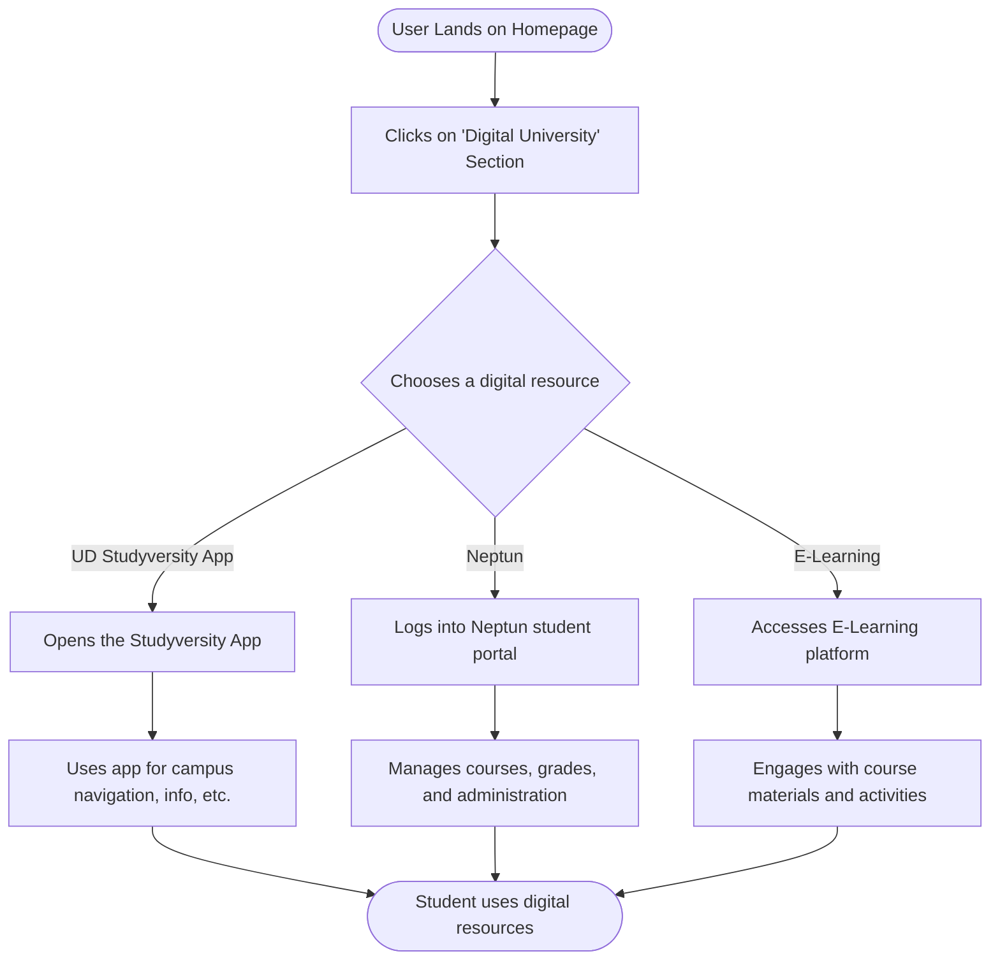

# Website Analysis Report: University of Debrecen - Faculty of Informatics

## 📋 Executive Summary
- **Website URL**: https://inf.unideb.hu/en
- **Analysis Date**: 2025-12-06
- **Languages Detected**: English (en)
- **Total Pages Analyzed**: 1 (Homepage)
- **Main Sections**: Education, Prospective Students, Digital University, Beyond Education, Media, Contact, Events
- **Key User Journeys Identified**: 1 (Exploring Faculty Information)

## 🎯 Website Summary
The website for the Faculty of Informatics at the University of Debrecen provides comprehensive information for prospective and current students, faculty, and visitors. It details the faculty's educational programs, research activities, administrative information, and campus life. The faculty emphasizes its commitment to quality education, internationalization, and digital learning.

## 📄 Content Overview
The homepage serves as a central hub, featuring a slideshow with important announcements and links, followed by sections on:

-   **News**: Latest updates and events relevant to the faculty and university.
-   **Prospective Students**: Information on scholarships, benefits, and university rankings.
-   **Education**: Details about the faculty structure, degree programs (undergraduate, graduate, PhD), and the overall educational offerings.
-   **Digital University**: Resources for digital learning, including apps like UD Studyversity, Neptun, E-Map, and E-Learning platforms.
-   **Beyond Education**: Information about the Clinical Centre and Agricultural Research Institutes, highlighting the university's broader impact.
-   **Media**: Links to videos and photo albums related to the faculty.
-   **Contact**: Essential contact information, including phone, email, address, and departmental phonebooks.
-   **Events**: A calendar displaying upcoming events.
-   **Formal**: Links to useful resources and a document library.

The content is presented in a structured and organized manner, with clear headings and calls to action. The website also includes information on data protection and cookie policies.

## 🗺️ Sitemap Diagram
The `firecrawl_map` tool was used to discover the site structure. Based on the initial mapping, a hierarchical structure can be inferred, with the homepage as the root. Key sections include Administration, Study, Awards, Conferences, Address, Campus, Organogram, Faculty, Foundation, Members, Regulations, Faculty Applications, DSC UNIDEB, and various staff/department pages.

```mermaid
graph TD
    A[Homepage: Faculty of Informatics] --> B[Administration]
    A --> C[Study]
    A --> D[Awards]
    A --> E[Conferences]
    A --> F[Address]
    A --> G[Campus]
    A --> H[Organogram]
    A --> I[Faculty]
    A --> J[Foundation]
    A --> K[Members]
    A --> L[Regulations]
    A --> M[Faculty Applications]
    A --> N[DSC UNIDEB]
    A --> O[Staff/Department Pages]
    A --> P[News]
    A --> Q[Prospective Students]
    A --> R[Education]
    A --> S[Digital University]
    A --> T[Beyond Education]
    A --> U[Media]
    A --> V[Contact]
    A --> W[Events]
    A --> X[Formal]
```



## 🔄 User Flow Diagrams

### User Flow 1: Prospective Student Exploring Programs
```mermaid
flowchart TD
    Start([User Lands on Homepage]) --> NavigateEducation[Clicks on 'Education' Section]
    NavigateEducation --> ViewFaculties[Explores 'Faculties' Page]
    ViewFaculties --> SelectFaculty[Selects a specific faculty (e.g., Informatics)]
    SelectFaculty --> ViewPrograms[Views available degree programs (BSc, MSc, PhD)]
    ViewPrograms --> CheckAdmissions[Navigates to 'Admission Process' or 'Prospective Students']
    CheckAdmissions --> FindInfo[Finds information on application procedures, scholarships, and requirements]
    FindInfo --> ContactAdmissions{Needs more info?}
    ContactAdmissions -->|Yes| ClickContact[Clicks on 'Contact' for admissions office]
    ContactAdmissions -->|No| End([User has program information])
    ClickContact --> SubmitInquiry[Submits an inquiry]
    SubmitInquiry --> End
```

### User Flow 2: Current Student Accessing Digital Resources


## 📊 Site Structure Details
-   **Homepage** (`/en`): Serves as the main entry point, providing an overview of the faculty, news, educational offerings, digital resources, and contact information.
-   **Administration**: Information related to the faculty's administrative offices and operations.
-   **Study**: Details about academic programs, curriculum, and student life.
-   **Awards**: Recognition and achievements of faculty and students.
-   **Conferences**: Information on academic conferences hosted or attended by the faculty.
-   **Address**: Physical location and contact details.
-   **Campus**: Information about the university campus and facilities.
-   **Organogram**: The organizational structure of the faculty.
-   **Faculty**: General information about the faculty itself.
-   **Foundation**: Details about any supporting foundations.
-   **Members**: Information about faculty members and staff.
-   **Regulations**: Official rules and guidelines.
-   **Faculty Applications**: Information on specific application processes.
-   **DSC UNIDEB**: Details about the Developer Students Clubs.
-   **News**: Latest updates and announcements.
-   **Prospective Students**: Resources for individuals interested in applying.
-   **Education**: Comprehensive overview of academic programs and faculties.
-   **Digital University**: Access to online learning tools and platforms.
-   **Beyond Education**: Information on related university centers and institutes.
-   **Media**: Links to multimedia content (videos, photos).
-   **Contact**: Contact details for various departments and offices.
-   **Events**: Calendar of upcoming events.
-   **Formal**: Links to important documents and resources.

## 🎯 Key User Journeys
1.  **Prospective Student Exploring Programs**: A user lands on the homepage, navigates to the 'Education' section, explores available programs, checks admission requirements, and potentially contacts the admissions office for more information.
2.  **Current Student Accessing Digital Resources**: A student visits the homepage and accesses essential digital tools like Neptun, E-Learning, or the Studyversity app for academic and administrative purposes.

## 🔍 Navigation Patterns
-   **Primary Navigation**: A prominent menu on the homepage likely includes main sections such as Education, Prospective Students, Digital University, etc.
-   **Internal Linking**: Extensive use of internal links within content to guide users to related pages (e.g., from news articles to event pages, or from program descriptions to admission details).
-   **Footer Navigation**: Contains links to formal documents, contact information, and potentially sitemap or privacy policy.
-   **Breadcrumbs**: Likely present on sub-pages to indicate the user's current location within the site hierarchy.
-   **Search Functionality**: A search bar is expected to be available for users to quickly find specific information.

## 📱 Content Types & Features
-   **Informational Pages**: Detailed descriptions of programs, faculty, departments, and university services.
-   **News Articles**: Updates on faculty and university events, achievements, and opportunities.
-   **Event Calendar**: A dynamic calendar displaying upcoming events.
-   **Multimedia**: Embedded videos and photo albums.
-   **Forms**: Contact forms, application forms (implied).
-   **Links to External/Internal Portals**: Direct links to Neptun, E-Learning, Studyversity, and other university systems.
-   **Contact Directories**: Phonebooks for departments and staff.

## 🎨 Design & UX Observations
The website features a clean and professional design, consistent with a university's academic branding. The use of the University of Debrecen's official colors and logos is evident. The layout is organized with clear sections and calls to action, aiming for a user-friendly experience. The homepage utilizes a slideshow to highlight key announcements and features.

## 🔗 External Integrations
-   **University Portals**: Links to Neptun, E-Learning, and Studyversity suggest integration with the university's core digital infrastructure.
-   **External News Source**: The "News" section links to hirek.unideb.hu, indicating content aggregation.
-   **Mapping Services**: A link to Google Maps for the faculty address.

## 📈 Technical Observations
-   **Technology Stack**: The website appears to be built on Drupal, as indicated by the `Generator: Drupal 10` metadata.
-   **Responsiveness**: The `MobileOptimized: width` and `HandheldFriendly: true` metadata suggest the site is designed to be responsive across devices.
-   **SEO**: Standard SEO elements like `robots: index, follow` and a clear `title` tag are present.
-   **Language**: Explicitly set to English (`language: en`).

## 📝 Additional Notes
The website effectively communicates the offerings and activities of the Faculty of Informatics. The structure is logical, catering to different user groups. Further analysis of specific sub-pages would provide deeper insights into content depth and user experience for particular journeys.