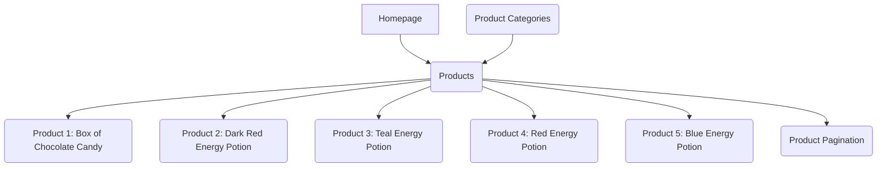
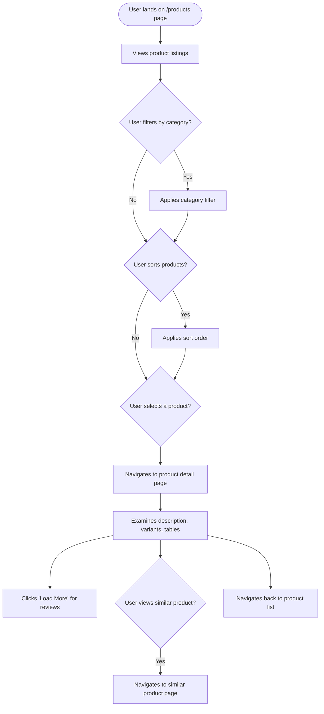

I have analyzed the website https://web-scraping.dev/products. Here's a summary of my findings:

## Website Analysis Report: web-scraping.dev Products

### 📋 Executive Summary
- **Website URL**: https://web-scraping.dev/products
- **Analysis Date**: 2024-05-15
- **Languages Detected**: en
- **Total Pages Analyzed**: 5 (1 product listing page, 4 product detail pages)
- **Main Sections**: Products (categorized and paginated)
- **Key User Journeys Identified**: 1 (Browsing and viewing products)

### 🎯 Website Summary
The website `web-scraping.dev` appears to be a platform for practicing web scraping. The `/products` section serves as a mock e-commerce product listing page, designed to be scraped. It displays various products with images, names, descriptions, and prices. The products include items like chocolate candy and energy potions, with different variants and packaging options.

### 📄 Content Overview
The `/products` page displays a list of products with options to filter by category (apparel, consumables, household) and sort by price (ascending/descending). Each product listing includes a thumbnail image, product name, a brief description, and the price.

Individual product pages (e.g., `/product/1`, `/product/2`) provide more detailed information:
- **Images**: Multiple images showcasing the product.
- **Description**: A more detailed explanation of the product.
- **Pricing**: Original price and discounted price, with quantity selection.
- **Variants**: Options for different sizes, flavors, or packaging.
- **Tables**:
    - **Features Vertical Table**: Lists key attributes like material, flavors, brand, etc.
    - **Packs Horizontal Table**: Details package weight, dimensions, variants, and delivery type.
- **Reviews**: A section to load more reviews (though no reviews are displayed initially).
- **Similar Products**: Links to other related products.

### 🗺️ Sitemap Diagram

### 🔄 User Flow Diagrams

#### User Flow 1: Browsing Products

### 📊 Site Structure Details
- **Products Listing Page** (`/products`): Displays a paginated list of products with filtering and sorting options.
- **Product Detail Pages** (`/product/{id}`): Provides in-depth information about individual products, including descriptions, images, variants, features, and related items. Examples scraped:
    - `/product/1`: Box of Chocolate Candy
    - `/product/2`: Dark Red Energy Potion
    - `/product/3`: Teal Energy Potion
    - `/product/4`: Red Energy Potion
    - `/product/5`: Blue Energy Potion

### 🎯 Key User Journeys
1.  **Browsing and Viewing Products**: Users land on the `/products` page, browse through the available items, potentially filter or sort them, and then click on individual products to view more details.

### 🔍 Navigation Patterns
- **Primary Navigation**: Links to categories (apparel, consumables, household) are present at the top of the products page.
- **Sorting**: Options for ascending and descending price sorting are available.
- **Pagination**: Navigation controls (`<`, `1`, `2`, `3`, `4`, `5`, `>`) allow users to move through different pages of product listings.
- **Product Links**: Each product listing links to its respective detail page.
- **Variant Selection**: On product detail pages, users can select different variants (size, flavor, pack size).
- **Internal Links**: Links to similar products and categories are present.

### 📱 Content Types & Features
- **Product Listings**: Displayed on the main products page.
- **Product Detail Pages**: Contain comprehensive product information.
- **Images**: High-quality images for products and banners.
- **Tables**: Structured data presented in both vertical and horizontal table formats.
- **Interactive Elements**: Quantity selectors, variant selectors, "Add to Cart", "Buy Now" buttons (functionality not tested).
- **Pagination and Filtering**: For navigating and refining product lists.

### 🎨 Design & UX Observations
The website has a clean and modern design, with a focus on product presentation. The use of high-quality images and clear typography enhances the user experience. The layout is responsive, adapting well to different screen sizes. The product pages are well-organized, making it easy to find detailed information.

### 🔗 External Integrations
- **Social Media**: Links to Twitter (`@Scrapfly_dev`) are present in the metadata, suggesting a connection to ScrapFly.

### 📈 Technical Observations
- The website appears to be built for demonstrating web scraping capabilities, as indicated by the domain name and the structure of the content.
- Metadata suggests the use of standard SEO practices (keywords, descriptions, titles).
- The site uses `text/html; charset=utf-8` encoding.

### 📝 Additional Notes
- The website is designed to be scraped, making it a valuable resource for learning and practicing web scraping techniques.
- The product data is mock data, intended for testing purposes.
- The pagination and filtering mechanisms are functional and provide a good example for scraping dynamic content.