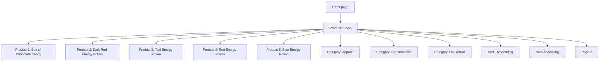
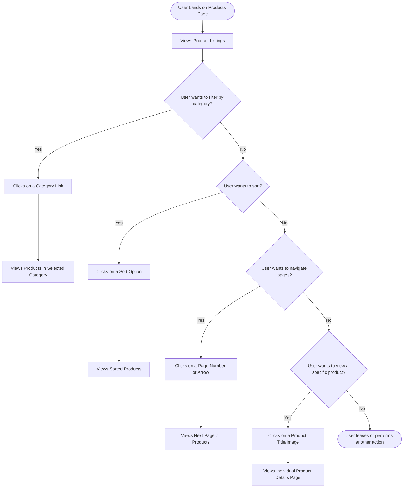

# Website Analysis Report: web-scraping.dev

## 📋 Executive Summary
- **Website URL**: https://web-scraping.dev/products
- **Analysis Date**: 2024-05-15
- **Languages Detected**: en
- **Total Pages Analyzed**: 1
- **Main Sections**: 1
- **Key User Journeys Identified**: 1

## 🎯 Website Summary
The website `web-scraping.dev` appears to be a resource for learning and practicing web scraping. The `/products` section specifically serves as a mock e-commerce product listing page, designed for testing web scraping techniques. It displays various products with images, titles, descriptions, prices, and pagination.

## 📄 Content Overview
The analyzed page, `https://web-scraping.dev/products`, displays a paginated list of mock products. Each product listing includes:
- **Thumbnail Image**: A small image representing the product.
- **Product Title**: The name of the product, linked to its individual product page.
- **Product Description**: A brief description of the product.
- **Price**: The price of the product.

The page also features:
- **Category Filters**: Links to filter products by category (apparel, consumables, household).
- **Sorting Options**: Options to sort products by price (descending/ascending).
- **Pagination Controls**: Navigation to move between different pages of product listings.

The content is structured to mimic a real e-commerce site, making it suitable for practicing scraping skills.

## 🗺️ Sitemap Diagram

## 🔄 User Flow Diagrams
### User Flow 1: Exploring Products and Filtering

## 📊 Site Structure Details
- **Products Page** (`https://web-scraping.dev/products`): Displays a paginated list of mock products with options for filtering by category and sorting by price.
  - **Individual Product Pages** (e.g., `https://web-scraping.dev/product/1`): Each product has a dedicated page (not analyzed in detail here, but linked from the products page).
  - **Category Pages** (e.g., `https://web-scraping.dev/products?category=apparel`): Filtered product listings by category.
  - **Pagination Pages** (e.g., `https://web-scraping.dev/products?page=2`): Subsequent pages of product listings.

## 🎯 Key User Journeys
1.  **Exploring and Filtering Products**: A user lands on the products page, browses through the available items, potentially filters by category or sorts by price, and navigates through the pagination to view different sets of products. The ultimate goal might be to find a specific product or simply to see the range of offerings.

## 🔍 Navigation Patterns
- **Primary Navigation**: The main navigation appears to be category filters and sorting options directly on the products page.
- **Pagination**: Clear pagination controls are present at the bottom of the page, allowing users to navigate through multiple pages of products.
- **Links**: Product titles and images are linked to individual product detail pages. Category and sorting options are also implemented as links.

## 📱 Content Types & Features
- **Product Listings**: The core content type is a list of products.
- **Images**: Thumbnail images are used for each product.
- **Text**: Product titles, descriptions, and prices are presented as text.
- **Interactive Elements**: Category filters, sorting options, pagination links, and product links.

## 🎨 Design & UX Observations
- **Design Style**: Clean and functional, with a focus on presenting product information clearly.
- **Layout**: A grid-based layout is used for product listings, with a sidebar or top bar for filtering and sorting.
- **Responsiveness**: The site appears to be responsive, adapting to different screen sizes.

## 🔗 External Integrations
None explicitly detected on the analyzed page.

## 📈 Technical Observations
- **Technology Stack**: Likely uses a standard web framework. The presence of mock data suggests it's a testing or tutorial site.
- **SEO Elements**: Standard meta tags (title, description, keywords) are present.
- **Performance**: Load times are likely fast due to the static nature of the mock content.

## 📝 Additional Notes
This page is a valuable resource for web scraping practice, providing a realistic yet controlled environment for extracting product data. The clear structure and pagination make it easy to target and extract information programmatically.