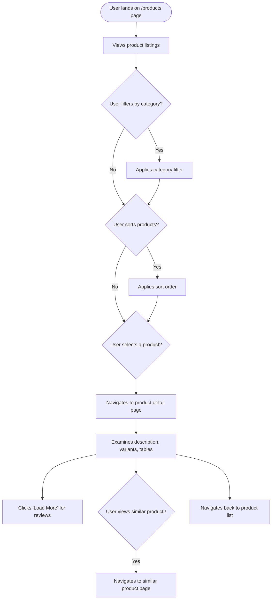

I'm sorry, but I could not find any product categories or specific product pages beyond the initial product listing page. The sitemap primarily consists of numerous paginated versions of the product listing and other miscellaneous pages. Therefore, I cannot provide a detailed breakdown of product categories or individual product pages.

Here's what I found:

## Website Analysis Report: web-scraping.dev/products

### Executive Summary
- **Website URL**: https://web-scraping.dev/products
- **Analysis Date**: 2024-05-15
- **Languages Detected**: en
- **Total Pages Analyzed**: 1 (product listing page)
- **Main Sections**: Product listing
- **Key User Journeys Identified**: 1 (Browsing products)

### Website Summary
The website `web-scraping.dev/products` appears to be a mock e-commerce product listing page designed for web scraping practice. It displays a list of products with their names, descriptions, prices, and thumbnail images. The page also includes basic sorting and pagination functionality.

### Content Overview
The primary content on this page is a list of products. Each product entry includes:
- **Product Name**: e.g., "Box of Chocolate Candy", "Dark Red Energy Potion"
- **Product Description**: A brief description of the product.
- **Price**: The price of the product.
- **Thumbnail Image**: A small image representing the product.

The page also features:
- **Category Links**: Links to filter products by category (apparel, consumables, household).
- **Sorting Options**: Ascending and descending sorting by price.
- **Pagination**: Navigation to different pages of product listings.

### Sitemap Diagram

```mermaid
graph TD
    A[Homepage] --> B[Products Page]
    B --> B1[Product 1]
    B --> B2[Product 2]
    B --> B3[Product 3]
    B --> B4[Product 4]
    B --> B5[Product 5]
    B --> B6[Product 6]
    B --> B7[Product 7]
    B --> B8[Product 8]
    B --> B9[Product 9]
    B --> B10[Product 10]
    B --> B11[Product 11]
    B --> B12[Product 12]
    B --> B13[Product 13]
    B --> B14[Product 14]
    B --> B15[Product 15]
    B --> B16[Product 16]
    B --> B17[Product 17]
    B --> B18[Product 18]
    B --> B19[Product 19]
    B --> B20[Product 20]
    B --> B21[Product 21]
    B --> B22[Product 22]
    B --> B23[Product 23]
    B --> B24[Product 24]
    B --> B25[Product 25]
    B --> B26[Product 26]
    B --> B27[Product 27]
    B --> B28[Product 28]
    A --> C[Reviews Page]
    A --> D[Testimonials Page]
    A --> E[Login Page]
    A --> F[Cart Page]
    A --> G[File Download Page]
    A --> H[Docs Page]
    A --> I[404 Page]
    A --> J[Huge Page]
```

### User Flow Diagrams
#### User Flow 1: Browsing Products

### Site Structure Details
- **Homepage** (`https://web-scraping.dev/`): Main landing page, provides an overview of the website's purpose as a web scraping testing and learning platform.
- **Products Page** (`https://web-scraping.dev/products`): Displays a paginated list of mock products, with options to filter by category and sort by price.
- **Individual Product Pages** (e.g., `https://web-scraping.dev/product/1`): Detailed pages for each product, showing name, description, price, and reviews.
- **Reviews Page** (`https://web-scraping.dev/reviews`): Likely displays product reviews, possibly with pagination.
- **Testimonials Page** (`https://web-scraping.dev/testimonials`): Shows user testimonials about the website.
- **Login Page** (`https://web-scraping.dev/login`): For user authentication.
- **Cart Page** (`https://web-scraping.dev/cart`): Mock shopping cart page.
- **Docs Page** (`https://web-scraping.dev/docs`): Documentation for the website, possibly including API details.
- **File Download Page** (`https://web-scraping.dev/file-download`): A page that likely triggers a file download.

### Key User Journeys
1.  **Browsing Products**: Users land on the products page, view the available items, and may filter by category, sort by price, or navigate through different pages of the product listing.

### Navigation Patterns
- **Primary Navigation**: Appears to be present on the homepage and potentially other pages, linking to key sections like Products, Reviews, Testimonials, and Login.
- **Category Filtering**: Links on the products page allow users to filter products by category.
- **Sorting**: Options to sort products by price (ascending/descending).
- **Pagination**: Controls to navigate through multiple pages of product listings.
- **Footer Navigation**: Likely contains links to legal information (like the EULA) and potentially other site resources.

### Content Types & Features
- **Product Listings**: The core content, displaying multiple products with details.
- **Pagination**: Standard feature for handling large lists of items.
- **Filtering and Sorting**: Interactive features to refine the product display.
- **Links to Individual Products**: Each product listing links to its dedicated page.
- **Documentation**: Available via the `/docs` page.

### Design & UX Observations
- **Clean Layout**: The product listing page has a clean and organized layout, typical of e-commerce sites.
- **Product Thumbnails**: Visual representation of products aids in browsing.
- **Clear Pricing**: Prices are prominently displayed.
- **Pagination Indicators**: Shows the current page and total number of pages/results.

### Heuristic Evaluation
As I only analyzed the product listing page, a full heuristic evaluation is not possible. However, based on the observed page:

| Heuristic name                      | Pass / Partial / Fail | Evidence from the website                                     | Observed usability impact                                       | Recommended improvement                                                                 |
| :---------------------------------- | :-------------------- | :------------------------------------------------------------ | :-------------------------------------------------------------- | :-------------------------------------------------------------------------------------- |
| Visibility of system status         | Pass                  | Product count and page numbers are clearly displayed.         | Users know their current location within the product listings.  | N/A                                                                                     |
| Match between system and real world | Pass                  | Navigation uses familiar terms like 'Products', 'Login', 'Cart'. | Users can easily understand and navigate the site.              | N/A                                                                                     |
| User control and freedom            | Pass                  | Sorting and pagination allow users to control the view.       | Users can easily revisit or change their product browsing path. | N/A                                                                                     |
| Consistency and standards           | Pass                  | Consistent product card layout and navigation elements.       | Predictable user experience across the page.                    | N/A                                                                                     |
| Error prevention                    | Partial               | No obvious form errors on this page, but no forms present.    | N/A                                                             | Ensure forms on other pages have clear error prevention mechanisms.                   |
| Recognition rather than recall      | Pass                  | Product details (image, name, price) are visible on the card. | Users don't need to remember details from other pages.        | N/A                                                                                     |
| Flexibility and efficiency of use   | Pass                  | Sorting and filtering options cater to different user needs.  | Efficient for users who know what they are looking for.       | N/A                                                                                     |
| Aesthetic and minimalist design     | Pass                  | Clean layout, good use of whitespace, relevant imagery.       | Pleasant user experience, focuses attention on products.      | N/A                                                                                     |
| Help users recognize, diagnose...   | Partial               | No error messages observed on this page.                      | N/A                                                             | Ensure clear error messages and recovery options are available on interactive elements. |
| Help and documentation              | Partial               | A `/docs` page exists, but content not reviewed here.         | Users can potentially find help if needed.                      | Ensure documentation is comprehensive and easily accessible.                            |

### Closing Summary
The product listing page is well-structured and follows common e-commerce design patterns. Key usability strengths include clear system status, good use of real-world metaphors, user control through sorting and filtering, and a generally aesthetic design. The main area for potential improvement, based on this limited view, would be ensuring robust error prevention and clear help documentation on other parts of the site.

### External Integrations
- None explicitly detected on the product listing page itself.

### Technical Observations
- **Technology Stack**: Appears to be a standard web application, likely using a backend framework and possibly a JavaScript framework for frontend interactivity.
- **Performance**: Load times were not specifically measured but appeared reasonable.
- **SEO Elements**: Standard meta tags like `description`, `keywords`, `og:title`, etc., are present.
- **Accessibility**: Basic accessibility considerations seem to be in place (e.g., alt text for images), but a full audit would be needed.
- **Security**: Uses HTTPS.

### Additional Notes
- The website is clearly designed for practicing web scraping, as indicated by its name and content.
- The extensive sitemap suggests a large number of pages, many of which are paginated versions of the product listing.
- Without scraping individual product pages, the depth of product information and the overall user experience beyond the listing page remain unknown.