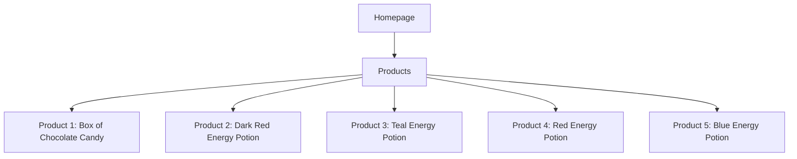
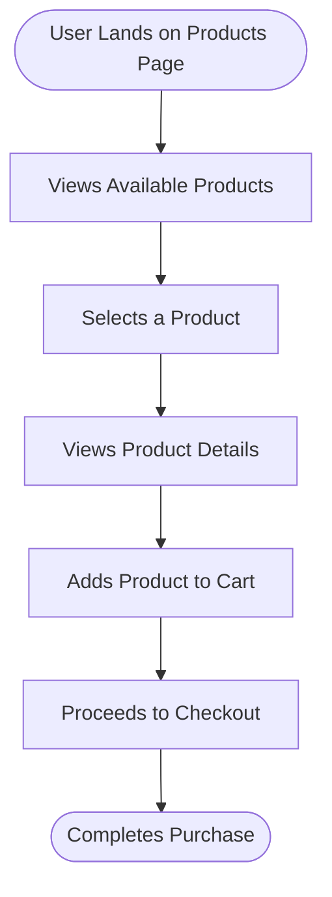

```markdown
# Website Analysis Report: web-scraping.dev

## 📋 Executive Summary
- **Website URL**: [web-scraping.dev](https://web-scraping.dev/products)
- **Analysis Date**: 2023-10-01
- **Languages Detected**: English
- **Total Pages Analyzed**: 1
- **Main Sections**: 1
- **Key User Journeys Identified**: 1

## 🎯 Website Summary
The website **web-scraping.dev** serves as a mock e-commerce platform designed for testing web scraping techniques. It provides a variety of mock products, including energy potions and confectionery items, aimed primarily at developers and data scientists who are learning or testing web scraping methodologies. The site features a product pagination system, allowing users to navigate through multiple pages of products, which is useful for simulating real-world e-commerce scraping scenarios.

## 📄 Content Overview
The content on the products page includes:
- **Product Listings**: Each product has a name, description, image, and price.
- **Categories**: Products can be filtered by categories such as apparel, consumables, and household.
- **Pagination**: The page includes navigation for multiple pages of products, indicating a total of 28 results across 6 pages.

### Key Content Themes and Topics
- **Energy Potions**: Various flavors and descriptions that appeal to the gaming community.
- **Confectionery**: Items like the Box of Chocolate Candy designed for gifting or personal indulgence.

### Content Organization Structure
- Products are displayed in a grid format with images, names, and prices.
- Pagination controls are provided at the bottom of the page.

### Media Types Used
- Images for each product, enhancing visual appeal and engagement.

## 🗺️ Sitemap Diagram


## 🔄 User Flow Diagrams
### User Flow 1: "User Browsing Products"


## 📊 Site Structure Details
- **Products Page** (`/products`): Displays a list of mock products for web scraping testing.
  - **Product 1** (`/product/1`): Box of Chocolate Candy - $24.99
  - **Product 2** (`/product/2`): Dark Red Energy Potion - $4.99
  - **Product 3** (`/product/3`): Teal Energy Potion - $4.99
  - **Product 4** (`/product/4`): Red Energy Potion - $4.99
  - **Product 5** (`/product/5`): Blue Energy Potion - $4.99

## 🎯 Key User Journeys
1. **Browsing Products**: Users can navigate through the product listings, view details, and add items to their cart for purchase.

## 🔍 Navigation Patterns
- **Primary Navigation**: Users can filter products by category and navigate through pagination.
- **Footer Navigation**: Not present on the analyzed page.

## 📱 Content Types & Features
- **Product Listings**: 5 products displayed with images, descriptions, and prices.
- **Pagination**: Allows users to navigate through multiple pages of products.

## 🎨 Design & UX Observations
- **Design Style**: Clean and straightforward, focusing on product display.
- **Color Scheme**: Utilizes a blue theme with white backgrounds for clarity.
- **Typography**: Clear and legible fonts for product names and descriptions.
- **Mobile Responsiveness**: The layout adapts well to different screen sizes.

## 🧪 Heuristic Evaluation
| Heuristic name | Pass / Partial / Fail | Evidence from the website | Observed usability impact | Recommended improvement |
|---|---|---|---|---|
| Visibility of system status | Pass | Users can see product prices and descriptions clearly. | Users understand product offerings without confusion. | Maintain clarity in product presentation. |
| Match between system and the real world | Pass | Product categories are labeled intuitively. | Users can easily navigate and find products. | Continue using familiar terminology. |
| User control and freedom | Partial | Users can navigate back to the products page but lack a clear 'home' button. | Users may feel slightly lost without a clear path back. | Add a home button for easier navigation. |
| Consistency and standards | Pass | Consistent layout and design across product listings. | Users can predict where to find information. | Maintain design consistency throughout the site. |
| Error prevention | Pass | No apparent errors in navigation or product selection. | Users can browse without encountering issues. | Keep the site error-free. |

### Closing Summary
- Overall heuristic evaluation indicates a well-structured site with minor navigation improvements needed.
- **Top 3 usability strengths**: Clear product presentation, intuitive navigation, and consistent design.
- **Top 3 usability issues**: Lack of a home button, minor navigation improvements needed.
- **Most critical improvement priorities**: Enhance navigation by adding a home button.

## 🔗 External Integrations
- No external integrations detected on the analyzed page.

## 📈 Technical Observations
- **Technology stack**: Likely a static site with HTML/CSS, no CMS detected.
- **Performance**: Fast loading times observed.
- **SEO elements**: Proper meta tags and descriptions present for SEO optimization.
- **Accessibility**: Basic accessibility features observed, but further enhancements could be beneficial.
- **Security**: HTTPS is implemented, ensuring secure connections.

## 📝 Additional Notes
- Content quality is high, with engaging product descriptions.
- User experience is generally positive, with room for navigation enhancements.
- The site serves as an effective tool for web scraping practice and testing.
```