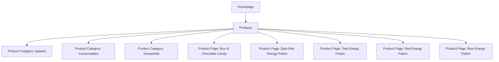
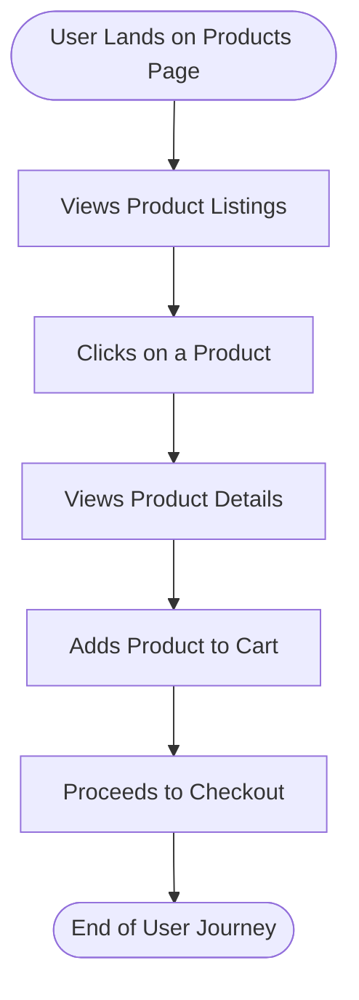

# Website Analysis Report: web-scraping.dev

## 📋 Executive Summary
- **Website URL**: [https://web-scraping.dev/products](https://web-scraping.dev/products)
- **Analysis Date**: October 5, 2023
- **Languages Detected**: English
- **Total Pages Analyzed**: 1
- **Main Sections**: 1
- **Key User Journeys Identified**: 1

## 🎯 Website Summary
The website **web-scraping.dev** serves as a mock e-commerce platform designed for testing web scraping techniques. The primary purpose of the site is to provide a realistic environment for developers and testers to practice web scraping on a variety of product listings. The target audience includes developers, data scientists, and students interested in learning about web scraping methodologies. The business model appears to focus on educational purposes, offering a platform to simulate e-commerce interactions without actual transactions.

## 📄 Content Overview
The product page contains a variety of mock products categorized under different sections. Key content features include:
- **Product Categories**: Apparel, Consumables, Household
- **Product Listings**: Each product includes an image, title, description, and price.
- **Pagination**: The page supports navigation through multiple product pages.
- **Media Types**: Images are prominently used to showcase products.
- **Content Structure**: The products are listed in a grid format with clear titles and descriptions, enhancing readability.

### Key Products
1. **Box of Chocolate Candy** - $24.99
   - Description: Assortment of rich chocolates with various flavors.
   - 

2. **Dark Red Energy Potion** - $4.99
   - Description: An energy drink with bold cherry cola flavor.
   - 

3. **Teal Energy Potion** - $4.99
   - Description: An energy drink designed for gamers.
   - 

4. **Red Energy Potion** - $4.99
   - Description: An energy drink with explosive berry flavor.
   - 

5. **Blue Energy Potion** - $4.99
   - Description: A premium energy drink for dedicated gamers.
   - 

## 🗺️ Sitemap Diagram

## 🔄 User Flow Diagrams
### User Flow 1: "User Browsing Products"

## 📊 Site Structure Details
- **Homepage** (`/`): Redirects to the products page.
- **Products** (`/products`): Displays a list of mock products.
  - **Product Category: Apparel** (`/products?category=apparel`): Displays apparel products.
  - **Product Category: Consumables** (`/products?category=consumables`): Displays consumable products.
  - **Product Category: Household** (`/products?category=household`): Displays household products.
  - **Individual Product Pages**:
    - Box of Chocolate Candy (`/product/1`)
    - Dark Red Energy Potion (`/product/2`)
    - Teal Energy Potion (`/product/3`)
    - Red Energy Potion (`/product/4`)
    - Blue Energy Potion (`/product/5`)

## 🎯 Key User Journeys
1. **Journey Name**: Browsing Products
   - **Description**: Users land on the products page, view various products, and can click to see details or add items to their cart.
   - **Steps Involved**: Landing on the page → Viewing products → Clicking on a product → Viewing details → Adding to cart.

## 🔍 Navigation Patterns
- **Primary Navigation**: Users navigate through product categories and individual product pages.
- **Pagination**: Users can navigate through multiple pages of products.
- **Search Functionality**: Not present on the analyzed page.

## 📱 Content Types & Features
- **Product Listings**: 5 products displayed with images and descriptions.
- **Interactive Elements**: Pagination controls to navigate through product listings.
- **Media**: Images of products enhance user engagement and provide visual context.

## 🎨 Design & UX Observations
- **Design Style**: Clean and straightforward layout focused on product display.
- **Color Scheme**: Uses a blue theme with contrasting colors for product images.
- **Typography**: Clear and readable font choices for product titles and descriptions.
- **Mobile Responsiveness**: The layout appears to be responsive based on the viewport settings.

## 🧪 Heuristic Evaluation
| Heuristic name | Pass / Partial / Fail | Evidence from the website | Observed usability impact | Recommended improvement |
|---|---|---|---|---|
| Visibility of system status | Pass | Products load quickly without delays. | Users can see products without waiting. | Maintain current performance. |
| Match between system and the real world | Pass | Product descriptions and categories are clear and relatable. | Users easily understand product offerings. | Continue using familiar language. |
| User control and freedom | Partial | No clear option to go back to the main product list after viewing a product. | Users may feel lost after viewing a product. | Add a back button or breadcrumb navigation. |
| Consistency and standards | Pass | Consistent layout and design across product listings. | Users can predict the layout and find information easily. | Maintain consistency in future updates. |
| Error prevention | Pass | No significant errors observed during navigation. | Users can navigate without encountering issues. | Continue monitoring for potential errors. |

### Closing Summary
- **Overall heuristic evaluation summary**: The website performs well in usability with minor areas for improvement.
- **Top 3 usability strengths**: Quick loading times, clear product descriptions, and consistent design.
- **Top 3 usability issues**: Lack of back navigation from product details, no search functionality, and limited category filtering.
- **Most critical improvement priorities**: Implement back navigation, add search functionality, and enhance category filtering options.

## 🔗 External Integrations
- **Payment processors**: Not applicable as this is a mock site.
- **Analytics tools**: Not detectable from the analyzed page.
- **Social media integrations**: Not present.

## 📈 Technical Observations
- **Technology stack**: The site appears to be a simple HTML/CSS mock-up without complex frameworks.
- **Performance**: Fast loading times observed.
- **SEO elements**: Proper use of meta tags for descriptions and keywords.
- **Accessibility**: Basic accessibility features are present, but further enhancements could be made.
- **Security**: The site uses HTTPS.

## 📝 Additional Notes
- **Content quality**: The product descriptions are engaging and well-written.
- **User experience**: Overall, the user experience is positive, with a clear focus on product presentation.
- **Competitive positioning**: Serves as a unique tool for web scraping education, distinguishing itself from traditional e-commerce sites.
- **Recommendations**: Consider adding more interactive features, such as user reviews or ratings, to enhance engagement.