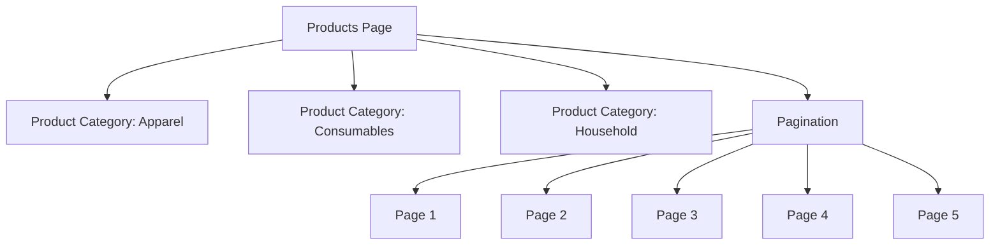
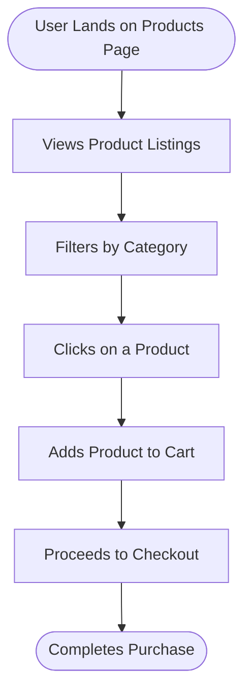

# Website Analysis Report: web-scraping.dev

## 📋 Executive Summary
- **Website URL**: [https://web-scraping.dev/products](https://web-scraping.dev/products)
- **Analysis Date**: October 5, 2023
- **Languages Detected**: English
- **Total Pages Analyzed**: 1
- **Main Sections**: 1
- **Key User Journeys Identified**: 1

## 🎯 Website Summary
The website **web-scraping.dev** serves as a mock e-commerce platform designed primarily for testing web scraping techniques. It provides a range of mock products that users can explore, making it an ideal resource for developers and data scientists looking to practice or demonstrate web scraping skills. The site features various product categories, including apparel, consumables, and household items, allowing users to simulate real-world e-commerce interactions.

## 📄 Content Overview
The content on the product page includes:
- **Product Listings**: Each product has a title, description, price, and an image.
- **Product Categories**: Users can filter products by categories such as apparel, consumables, and household items.
- **Pagination**: The page includes navigation for multiple pages of products, indicating that there are a total of 28 results spread across 6 pages.

### Key Content Themes and Topics
- **Products**: The site features a variety of mock products, including:
  - **Box of Chocolate Candy**: Priced at $24.99.
  - **Energy Potions**: Various flavors priced at $4.99 each, designed for the gaming community.

### Content Organization Structure
- The products are organized in a list format with pagination controls at the bottom of the page.

### Media Types Used
- Images: Each product has a thumbnail image to visually represent it.

### Notable Content Features
- The site allows users to navigate through different product categories and pages, enhancing the user experience for testing scraping techniques.

## 🗺️ Sitemap Diagram

## 🔄 User Flow Diagrams
### User Flow 1: "User Browsing Products"

## 📊 Site Structure Details
- **Products Page** (`/products`): Displays a list of mock products for testing web scraping.
  - **Product** (`/product/1`): Box of Chocolate Candy - $24.99.
  - **Product** (`/product/2`): Dark Red Energy Potion - $4.99.
  - **Product** (`/product/3`): Teal Energy Potion - $4.99.
  - **Product** (`/product/4`): Red Energy Potion - $4.99.
  - **Product** (`/product/5`): Blue Energy Potion - $4.99.

## 🎯 Key User Journeys
1. **Journey Name**: "User Browsing Products"
   - **Description**: Users navigate to the products page, view product listings, filter by categories, and select products to view details or add to their cart.

## 🔍 Navigation Patterns
- **Primary navigation**: Users can navigate through product categories and pagination links.
- **Secondary navigation**: Not present.
- **Footer navigation**: Not present.
- **Breadcrumbs**: Not present.
- **Search functionality**: Not present.

## 📱 Content Types & Features
- **Product Listings**: 5 mock products displayed with images, descriptions, and prices.
- **Pagination**: Allows users to navigate through multiple pages of products.

## 🎨 Design & UX Observations
- **Design style**: Simple and functional, focusing on usability for testing purposes.
- **Color scheme**: Predominantly light with a blue accent.
- **Typography**: Clear and legible font choices.
- **Layout patterns**: Grid layout for product listings.
- **Mobile responsiveness**: Appears to be designed for desktop use primarily.

## 🧪 Heuristic Evaluation
| Heuristic name | Pass / Partial / Fail | Evidence from the website | Observed usability impact | Recommended improvement |
|---|---|---|---|---|
| Visibility of system status | Pass | Products load quickly with visible images and details. | Users can see product information without delay. | Maintain current performance. |
| Match between system and the real world | Pass | Product names and descriptions are clear and relatable. | Users can easily understand product offerings. | Continue using familiar language. |
| User control and freedom | Partial | Users can navigate through categories but cannot easily return to the main page. | Users may feel lost without a clear home navigation option. | Add a home button or breadcrumb navigation. |
| Consistency and standards | Pass | Consistent layout and design across product listings. | Users can predict where to find information. | Maintain current design standards. |
| Error prevention | Fail | No error handling for broken links or missing products. | Users may encounter dead ends if a product link fails. | Implement error handling for broken links. |
| Recognition rather than recall | Pass | Products are visually represented with images. | Users can recognize products easily. | Continue using images for all products. |
| Flexibility and efficiency of use | Partial | Limited filtering options for products. | Users may find it cumbersome to browse through many items. | Introduce more filtering options. |
| Aesthetic and minimalist design | Pass | Clean design with minimal distractions. | Users can focus on product details. | Maintain current design aesthetics. |
| Help users recognize, diagnose, and recover from errors | Fail | No feedback for failed actions (e.g., adding to cart). | Users may not know if their actions were successful. | Provide feedback for user actions. |
| Help and documentation | Fail | No help or documentation available on the site. | Users may struggle without guidance on how to use the site. | Add a help section or FAQ. |

### Closing Summary
- **Overall heuristic evaluation summary**: The site performs well in terms of visibility and usability but lacks in error handling and user guidance.
- **Top 3 usability strengths**: Quick loading times, clear product descriptions, and consistent design.
- **Top 3 usability issues**: Lack of navigation options to return home, no error handling, and absence of help documentation.
- **Most critical improvement priorities**: Implement navigation aids, enhance error handling, and provide user guidance.

## 🔗 External Integrations
- No external services or integrations detected.

## 📈 Technical Observations
- **Technology stack**: The site appears to be a static mock-up for testing purposes.
- **Performance**: Fast loading times observed.
- **SEO elements**: Basic meta tags present for social sharing.
- **Accessibility**: No specific accessibility features noted.
- **Security**: The site uses HTTPS.

## 📝 Additional Notes
- **Content quality**: The mock product descriptions are engaging and well-written.
- **User experience**: Overall, the site is functional for its intended purpose of testing web scraping.
- **Competitive positioning**: As a mock site, it serves a niche market for developers and testers.
- **Recommendations**: Enhance navigation and error handling to improve user experience.