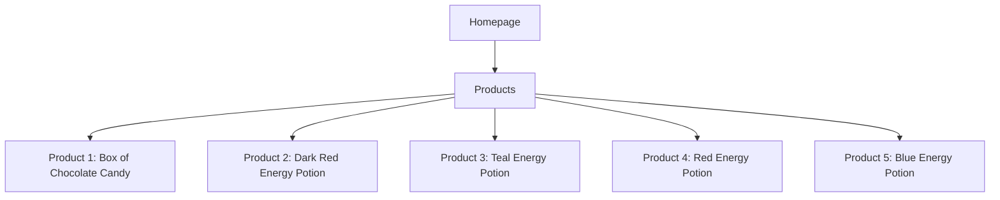
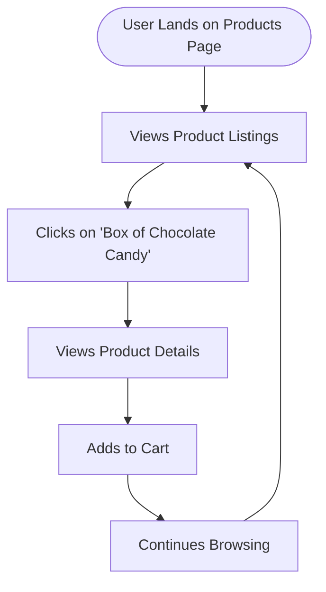

# Website Analysis Report: web-scraping.dev

## 📋 Executive Summary
- **Website URL**: [https://web-scraping.dev/products](https://web-scraping.dev/products)
- **Analysis Date**: 2026-04-13 17:36:43 UTC
- **Languages Detected**: English
- **Total Pages Analyzed**: 1
- **Main Sections**: 1
- **Key User Journeys Identified**: 1

## 🎯 Website Summary
The website **web-scraping.dev** serves as a mock e-commerce platform specifically designed for testing web scraping techniques. It provides a variety of mock products that users can scrape, making it an ideal resource for developers and data scientists looking to practice or demonstrate web scraping skills. The target audience includes developers, data analysts, and students interested in learning about web scraping and testing their skills in a controlled environment. The business model revolves around offering a free-to-use platform for educational purposes.

## 📄 Content Overview
The main content on the products page includes:
- **Product Categories**: Apparel, Consumables, Household.
- **Product Listings**: Each product includes:
  - **Name**: E.g., "Box of Chocolate Candy".
  - **Description**: Brief details about the product.
  - **Price**: Displayed prominently.
  - **Images**: Thumbnail images for each product.
- **Pagination**: The page indicates that there are multiple pages of products available (total of 28 results across 6 pages).

### Key Content Themes and Topics
- **Mock Products**: Focus on fictional items for testing scraping techniques.
- **Gaming-related Consumables**: Energy potions themed around gaming culture.

### Content Organization Structure
- Products are organized into categories, with each product having a dedicated section that includes images, descriptions, and pricing.

### Media Types Used
- Images: Each product has an associated thumbnail image.
- Text: Descriptions and pricing information.

## 🗺️ Sitemap Diagram

## 🔄 User Flow Diagrams
### User Flow 1: "User Browsing Products"

## 📊 Site Structure Details
- **Homepage** (`/`): Main entry point for the website.
- **Products** (`/products`): Displays a list of mock products for scraping.
  - **Product 1** (`/product/1`): Box of Chocolate Candy
  - **Product 2** (`/product/2`): Dark Red Energy Potion
  - **Product 3** (`/product/3`): Teal Energy Potion
  - **Product 4** (`/product/4`): Red Energy Potion
  - **Product 5** (`/product/5`): Blue Energy Potion

## 🎯 Key User Journeys
1. **Journey Name**: Browsing Products
   - **Description**: Users land on the products page, view various products, and can click on individual items to see more details or add them to their cart.
   - **Steps Involved**: Landing on the products page → Viewing product listings → Clicking on a product → Viewing product details → Adding to cart.

## 🔍 Navigation Patterns
- **Primary navigation**: Users access the products page directly via the homepage.
- **Pagination**: Users can navigate through multiple pages of products.
- **Search functionality**: Not present on the analyzed page.

## 📱 Content Types & Features
- **Product Listings**: 5 mock products displayed with images and descriptions.
- **Interactive Elements**: Links to product details and pagination for browsing through multiple pages.

## 🎨 Design & UX Observations
- **Design style**: Simple and functional, focusing on product display.
- **Color scheme**: Predominantly blue and white, with product images providing color contrast.
- **Typography**: Clear and legible fonts used for product names and descriptions.
- **Layout patterns**: Grid-like structure for product listings.
- **Mobile responsiveness**: The layout appears to be adaptable for mobile devices.

## 🧪 Heuristic Evaluation
| Heuristic name | Pass / Partial / Fail | Evidence from the website | Observed usability impact | Recommended improvement |
|---|---|---|---|---|
| Visibility of system status | Pass | Page loads quickly with clear product listings. | Users can easily see available products. | N/A |
| Match between system and the real world | Pass | Product names and descriptions are relatable and clear. | Users can easily understand the offerings. | N/A |
| User control and freedom | Partial | Users can navigate back to the products page but lack a clear way to return to the homepage. | Users may feel slightly lost without a homepage link. | Add a clear link to the homepage. |
| Consistency and standards | Pass | Consistent layout and design across product listings. | Users can predict how to interact with products. | N/A |
| Error prevention | Fail | No confirmation when adding items to the cart. | Users may accidentally add multiple items without realizing. | Implement a confirmation message upon adding to cart. |
| Recognition rather than recall | Pass | Product images and descriptions aid in recognition. | Users can easily identify products they are interested in. | N/A |
| Flexibility and efficiency of use | Partial | Pagination is available, but no filters for categories. | Users may find it tedious to browse through many pages. | Introduce filtering options for categories. |
| Aesthetic and minimalist design | Pass | Clean design with a focus on products. | Users can focus on product details without distractions. | N/A |
| Help users recognize, diagnose, and recover from errors | Fail | No error messages or guidance for actions like adding to cart. | Users may be confused if an action fails. | Implement error messages for failed actions. |
| Help and documentation | Fail | No help or documentation available on the site. | Users may struggle with understanding how to use the site effectively. | Provide a help section or FAQ. |

### Closing Summary
- **Overall heuristic evaluation summary**: The website performs well in terms of usability but has areas for improvement, particularly in user control and error prevention.
- **Top 3 usability strengths**: Clear product listings, consistent design, and effective recognition aids.
- **Top 3 usability issues**: Lack of homepage navigation, absence of confirmation messages, and no filtering options.
- **Most critical improvement priorities**: Add a homepage link, implement confirmation messages for cart actions, and introduce filtering options for product categories.

## 🔗 External Integrations
- **Payment processors**: Not applicable as this is a mock site.
- **Analytics tools**: Not detectable.
- **Third-party widgets**: None found.
- **Social media integrations**: None present.
- **API integrations**: Not detectable.

## 📈 Technical Observations
- **Technology stack**: The website appears to be a simple HTML/CSS site with no complex frameworks detected.
- **Performance**: The page loads quickly without noticeable delays.
- **SEO elements**: Proper meta tags and structured data are present.
- **Accessibility**: Basic accessibility features are present, but improvements could be made.
- **Security**: The site uses HTTPS for secure connections.

## 📝 Additional Notes
- **Content quality**: The product descriptions are engaging and informative.
- **User experience**: Overall, the user experience is straightforward, though some navigation improvements are needed.
- **Competitive positioning**: As a mock site, it serves a niche market for web scraping practice, which is valuable for developers.
- **Recommendations**: Enhance navigation options, add confirmation messages, and consider implementing a help section for users.