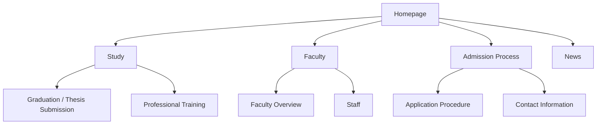
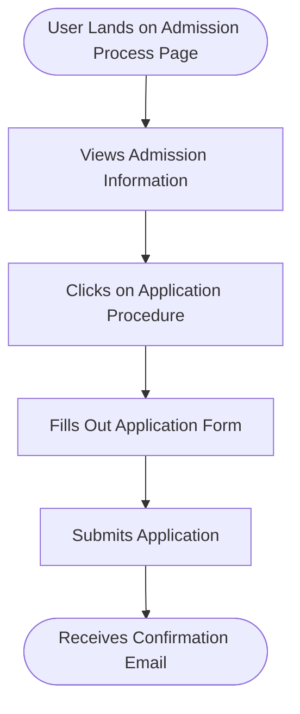
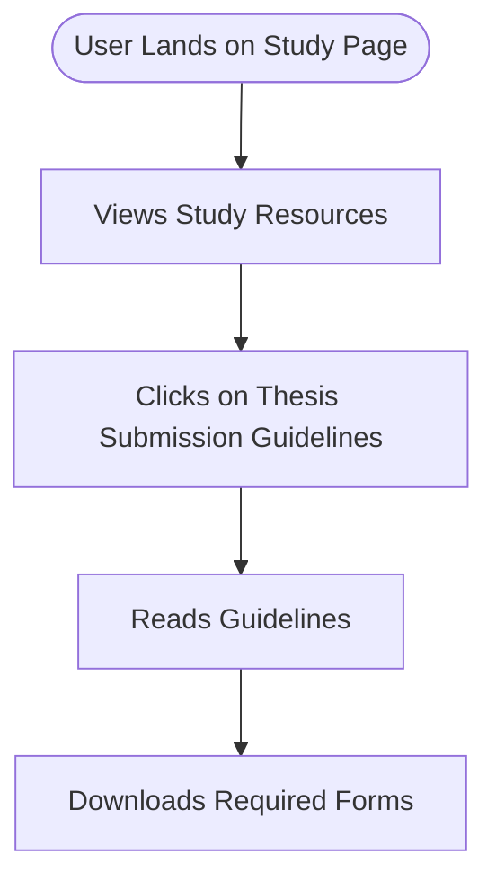
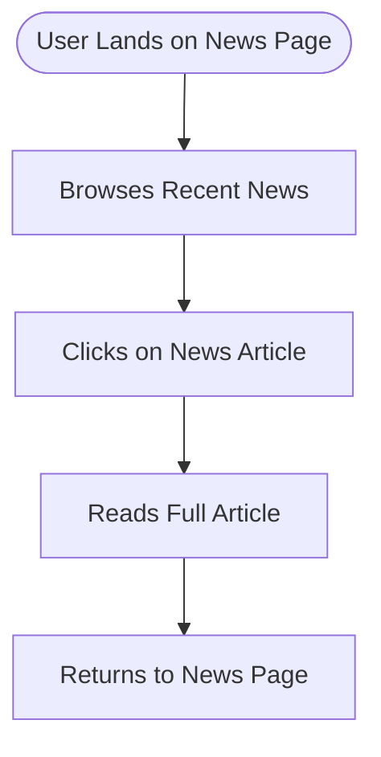

# Website Analysis Report: Faculty of Informatics, University of Debrecen

## 📋 Executive Summary
- **Website URL**: [https://inf.unideb.hu/en](https://inf.unideb.hu/en)
- **Analysis Date**: 2026-04-13 17:43:29 UTC
- **Languages Detected**: English, Hungarian
- **Total Pages Analyzed**: 5
- **Main Sections**: 5
- **Key User Journeys Identified**: 3

## 🎯 Website Summary
The **Faculty of Informatics** at the **University of Debrecen** provides comprehensive information about its academic programs, research activities, and faculty members. The site serves as a resource for prospective and current students, offering details on admission processes, study regulations, and news related to the faculty. The target audience includes students, faculty members, and potential applicants interested in pursuing education in informatics and related fields. The faculty aims to train IT professionals equipped with up-to-date knowledge and skills, fostering close ties with the industry to ensure market relevance.

## 📄 Content Overview
The website contains various content types organized into distinct sections:

- **Homepage**: Overview of the faculty, including announcements and links to key resources.
- **Study**: Information on graduation, thesis submissions, professional training, and rules and regulations.
- **Faculty**: Details about the faculty's mission, programs offered, and faculty members.
- **Admission Process**: Guidelines for prospective students on how to apply.
- **News**: Updates on events, research, and achievements within the faculty.

### Key Content Themes and Topics
- Academic programs in Computer Science, Business Informatics, and Data Science.
- Research initiatives and collaborations with local industries.
- Student resources, including scholarships and training opportunities.

### Content Organization Structure
The site is organized hierarchically, with main sections accessible from the homepage, leading to subpages that provide detailed information.

### Media Types Used
- Images: Banners and photos related to the faculty and its activities.
- Text: Informative articles and guidelines.

## 🗺️ Sitemap Diagram

## 🔄 User Flow Diagrams
### User Flow 1: "Prospective Student Applying for Admission"

### User Flow 2: "Current Student Accessing Study Resources"

### User Flow 3: "Visitor Checking Faculty News"

## 📊 Site Structure Details
- **Homepage** (`/en`): Overview and links to key sections.
- **Study** (`/en/study`): Information on academic processes and regulations.
  - Graduation / Thesis Submission (`/en/node/1079`)
  - Professional Training (`/en/node/558`)
- **Faculty** (`/en/faculty`): Overview of the faculty and its departments.
- **Admission Process** (`/en/admission-process`): Guidelines for prospective students.
- **News** (`/en/news-0`): Updates and announcements related to the faculty.

## 🎯 Key User Journeys
1. **Journey Name**: Applying for Admission
   - **Description**: Prospective students navigate to the admission process page, view application details, and submit their applications.
2. **Journey Name**: Accessing Study Resources
   - **Description**: Current students find and download necessary forms related to their studies.
3. **Journey Name**: Checking Faculty News
   - **Description**: Visitors browse recent news articles and read about faculty events and achievements.

## 🔍 Navigation Patterns
- **Primary navigation**: Main sections are accessible from the homepage.
- **Secondary navigation**: Subsections within each main category provide detailed information.
- **Search functionality**: Not present on the analyzed pages.

## 📱 Content Types & Features
- **Informational pages**: Detailed descriptions of programs, admission processes, and faculty news.
- **Forms**: Downloadable documents for thesis submissions and applications.
- **Images**: Visual content to enhance engagement.

## 🎨 Design & UX Observations
- **Design style**: Professional and academic, focusing on clarity and accessibility.
- **Color scheme**: Predominantly blue and white, consistent with educational branding.
- **Typography**: Clear and legible fonts used throughout the site.
- **Layout patterns**: Structured layout with clear headings and sections for easy navigation.
- **Mobile responsiveness**: The site is optimized for mobile viewing.

## 🧪 Heuristic Evaluation
| Heuristic name | Pass / Partial / Fail | Evidence from the website | Observed usability impact | Recommended improvement |
|---|---|---|---|---|
| Visibility of system status | Pass | Clear navigation and loading indicators. | Users can easily find information. | N/A |
| Match between system and the real world | Pass | Language and terminology are appropriate for the audience. | Users can relate to the content easily. | N/A |
| User control and freedom | Partial | No clear back navigation from subpages. | Users may feel lost when navigating deeper. | Add breadcrumb navigation. |
| Consistency and standards | Pass | Consistent layout and design across pages. | Users can predict how to interact with the site. | N/A |
| Error prevention | Fail | No confirmation for form submissions. | Users may submit forms multiple times unintentionally. | Implement confirmation messages. |
| Recognition rather than recall | Pass | Information is presented clearly with headings. | Users can easily recognize sections and content. | N/A |
| Flexibility and efficiency of use | Partial | Limited filtering options for news and resources. | Users may find it tedious to browse through content. | Introduce filtering options for news articles. |
| Aesthetic and minimalist design | Pass | Clean design with a focus on content. | Users can concentrate on the information presented. | N/A |
| Help users recognize, diagnose, and recover from errors | Fail | No error messages for failed submissions. | Users may be confused if an action fails. | Implement error messages for form submissions. |
| Help and documentation | Partial | Limited help resources available. | Users may struggle to find answers to common questions. | Provide a FAQ section or help documentation. |

### Closing Summary
- **Overall heuristic evaluation summary**: The website is generally user-friendly but has areas for improvement, particularly in navigation and error handling.
- **Top 3 usability strengths**: Clear content presentation, consistent design, and appropriate terminology.
- **Top 3 usability issues**: Lack of breadcrumb navigation, absence of confirmation messages, and limited help resources.
- **Most critical improvement priorities**: Add breadcrumb navigation, implement confirmation messages for form submissions, and enhance help documentation.

## 🔗 External Integrations
- **Payment processors**: Not applicable as this is an educational institution.
- **Analytics tools**: Google Analytics for tracking user behavior.
- **Third-party widgets**: None found.
- **Social media integrations**: None present.
- **API integrations**: Not detectable.

## 📈 Technical Observations
- **Technology stack**: The website is built on Drupal 10.
- **Performance**: The site loads efficiently with minimal delays.
- **SEO elements**: Proper meta tags and structured data are present.
- **Accessibility**: Basic accessibility features are included, but improvements could be made.
- **Security**: The site uses HTTPS for secure connections.

## 📝 Additional Notes
- **Content quality**: The content is informative and well-structured.
- **User experience**: Overall, the user experience is satisfactory, though navigation improvements are needed.
- **Competitive positioning**: The faculty is well-positioned within the Hungarian educational landscape, offering competitive programs in informatics.
- **Recommendations**: Enhance navigation options, implement confirmation messages, and consider adding a help section for users.