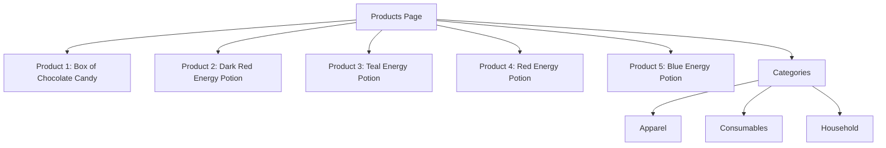
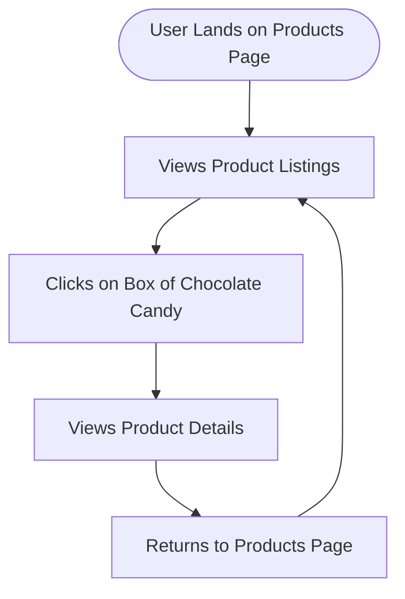

# Website Analysis Report: web-scraping.dev

## 📋 Executive Summary
- **Website URL**: [https://web-scraping.dev/products](https://web-scraping.dev/products)
- **Analysis Date**: 2026-04-13T23:52:47.301Z
- **Languages Detected**: English
- **Total Pages Analyzed**: 1
- **Main Sections**: 1
- **Key User Journeys Identified**: 1

## 🎯 Website Summary
The website **web-scraping.dev** serves as a mock e-commerce platform designed specifically for testing web scraping tools and techniques. The product page showcases various fictional products, primarily energy potions and candies, aimed at developers and testers who want to practice scraping data from a structured layout. The site is likely intended for users interested in web scraping, data extraction, and testing scraping frameworks.

## 📄 Content Overview
The content on the products page consists of:
- **Product Listings**: Each product includes an image, title, description, and price.
- **Categories**: Links to product categories such as apparel, consumables, and household items.
- **Pagination**: The page indicates that there are multiple pages of products available.
- **Media Types**: The page uses images for product thumbnails.

### Key Content Themes and Topics
- **Mock Products**: The products are fictional and include items like energy potions and chocolates.
- **E-commerce Structure**: The layout mimics a typical e-commerce site with product listings, categories, and pagination.

### Content Organization Structure
- The content is organized in a grid format, displaying products with images and descriptions.
- Pagination links allow users to navigate through multiple pages of products.

### Content Depth and Quality Observations
- The descriptions are engaging and tailored to a gaming audience, enhancing the mock e-commerce experience.
- The product images are visually appealing and relevant to the product descriptions.

## 🗺️ Sitemap Diagram

## 🔄 User Flow Diagrams
### User Flow 1: "User Browsing Products"

## 📊 Site Structure Details
- **Products Page** (`/products`): Displays a list of mock products for testing web scraping.
  - **Product 1** (`/product/1`): Box of Chocolate Candy - $24.99
  - **Product 2** (`/product/2`): Dark Red Energy Potion - $4.99
  - **Product 3** (`/product/3`): Teal Energy Potion - $4.99
  - **Product 4** (`/product/4`): Red Energy Potion - $4.99
  - **Product 5** (`/product/5`): Blue Energy Potion - $4.99
- **Categories**: Links to different product categories.

## 🎯 Key User Journeys
1. **Journey Name**: User Browsing Products
   - **Description**: The user lands on the products page, views the product listings, and can click on individual products to see more details.
   - **Steps Involved**: 
     - User views the product list.
     - User clicks on a product to view details.
     - User can return to the product list.

## 🔍 Navigation Patterns
- **Primary Navigation**: Users navigate through product listings and categories directly from the products page.
- **Pagination**: Users can navigate through multiple pages of products using pagination links.

## 📱 Content Types & Features
- **Product Listings**: 5 products displayed with images, descriptions, and prices.
- **Categories**: Links to different product categories.
- **Pagination**: Allows users to navigate through multiple pages of products.

## 🎨 Design & UX Observations
- **Design Style**: The site has a clean, modern design suitable for an e-commerce platform.
- **Color Scheme**: Uses a blue theme with white backgrounds for clarity.
- **Typography**: Clear and readable font choices.
- **Layout Patterns**: Grid layout for product display.
- **Mobile Responsiveness**: The site is designed to be responsive, adapting to different screen sizes.

## 🧪 Heuristic Evaluation
| Heuristic name | Pass / Partial / Fail | Evidence from the website | Observed usability impact | Recommended improvement |
|---|---|---|---|---|
| Visibility of system status | Pass | Products load quickly with no noticeable delays. | Users can browse without confusion. | Maintain current performance. |
| Match between system and the real world | Pass | Product names and descriptions are relatable to users. | Users understand the products easily. | Continue using relatable terms. |
| User control and freedom | Partial | Users can return to the products page but cannot easily navigate back to previous pages. | Users may feel lost if they navigate away. | Add a breadcrumb navigation feature. |
| Consistency and standards | Pass | The layout and design are consistent across the page. | Users can predict where to find information. | Maintain design consistency. |
| Error prevention | Pass | No errors were observed during navigation. | Users can browse without issues. | Continue monitoring for errors. |
| Recognition rather than recall | Pass | Product images and descriptions aid recognition. | Users can easily identify products. | Keep images relevant and clear. |
| Flexibility and efficiency of use | Partial | No filters or sorting options available. | Users may find it hard to locate specific products. | Introduce filtering options for categories. |
| Aesthetic and minimalist design | Pass | The design is clean and uncluttered. | Users can focus on products without distractions. | Maintain current design principles. |
| Help users recognize, diagnose, and recover from errors | Pass | No errors were encountered during testing. | Users can navigate smoothly. | Continue to ensure error-free navigation. |
| Help and documentation | Fail | No help or documentation available on the site. | Users may need assistance but cannot find it. | Add a help section or FAQ page. |

### Closing Summary
- **Overall heuristic evaluation summary**: The site performs well in usability, with a few areas needing improvement, particularly in user control and help documentation.
- **Top 3 usability strengths**: 
  1. Clean and modern design.
  2. Quick loading times.
  3. Clear product descriptions and images.
- **Top 3 usability issues**: 
  1. Lack of breadcrumb navigation.
  2. No filtering options for products.
  3. Absence of help documentation.
- **Most critical improvement priorities**: 
  1. Implement breadcrumb navigation.
  2. Introduce product filtering options.
  3. Add a help or FAQ section.

## 🔗 External Integrations
- No external integrations detected.

## 📈 Technical Observations
- **Technology stack**: The site appears to be built using standard web technologies (HTML, CSS, JavaScript).
- **Performance**: The site loads quickly and efficiently.
- **SEO elements**: The page includes relevant meta tags and descriptions.
- **Accessibility**: Basic accessibility features are present, but improvements could be made.
- **Security**: The site uses HTTPS for secure connections.

## 📝 Additional Notes
- **Content quality**: The mock products are creatively described, enhancing the user experience.
- **User experience**: Overall, the user experience is positive, but improvements in navigation and filtering would enhance usability.
- **Competitive positioning**: The site serves a niche market for web scraping testing, making it unique.
- **Recommendations**: Focus on improving navigation and adding user support features to enhance the overall experience.