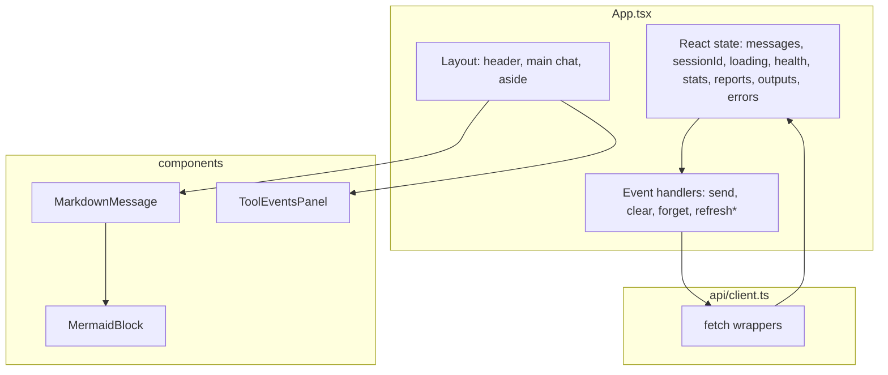

# General detailed project report — Web client (React SPA)

This report describes **only** the browser application in this repository: **Vite + React + TypeScript**, its **HTTP integration** with the Agentic Crawler FastAPI service, **state and session semantics**, **rendering pipeline** for markdown and Mermaid, and **operational** concerns (build, configuration, limitations). It is written so you can **paste it next to a backend report** and merge both into `THESIS_PROJECT_REPORT.md` (or your faculty template) with minimal reconciliation.

**What this document is not:** It does not specify Python, LangChain, MCP, or Firecrawl behavior beyond what the client observes through JSON HTTP responses and documented endpoint shapes.

---

## Table of contents

1. [Purpose and scope](#1-purpose-and-scope)
2. [System position and assumptions](#2-system-position-and-assumptions)
3. [Technology stack and rationale](#3-technology-stack-and-rationale)
4. [Repository layout](#4-repository-layout)
5. [Configuration and environments](#5-configuration-and-environments)
6. [External API surface (client view)](#6-external-api-surface-client-view)
7. [HTTP client layer](#7-http-client-layer)
8. [Application architecture](#8-application-architecture)
9. [State model](#9-state-model)
10. [Session lifecycle](#10-session-lifecycle)
11. [User flows](#11-user-flows)
12. [UI composition](#12-ui-composition)
13. [Markdown and diagram rendering](#13-markdown-and-diagram-rendering)
14. [Observability panels](#14-observability-panels)
15. [Error handling matrix](#15-error-handling-matrix)
16. [Accessibility and UX notes](#16-accessibility-and-ux-notes)
17. [Styling and layout](#17-styling-and-layout)
18. [Build, quality gates, and deployment](#18-build-quality-gates-and-deployment)
19. [Limitations and known trade-offs](#19-limitations-and-known-trade-offs)
20. [Merge checklist (with backend report)](#20-merge-checklist-with-backend-report)
21. [Glossary](#21-glossary)

---

## 1. Purpose and scope

### 1.1 Purpose

The web client provides a **human-operated interface** to an **agentic website-analysis backend**: users enter natural language (typically including URLs), receive **markdown** answers, optionally **Mermaid** diagrams embedded in markdown, and **structured tool traces** after each completed turn. The backend performs crawling and LLM orchestration; **this application never holds crawl or LLM API keys**.

### 1.2 In scope (this repository)

- Single-page application (SPA) delivered as static assets after `vite build`.
- REST-style JSON calls to a configurable **origin** (`VITE_API_BASE_URL`).
- Client-side **conversation identity** via `session_id` persistence.
- Presentation of **non-streaming** long-running responses (loading UI).
- Rendering **GitHub-Flavored Markdown** and **Mermaid** code fences.
- Side panels for **health**, **aggregate stats**, and **filesystem path lists** returned by the API.

### 1.3 Out of scope

- Authentication/authorization (no login UI, no tokens besides what the browser sends by default).
- Downloading report files by path (no file-serving endpoint assumed in the client).
- Server-Sent Events or WebSockets (API specified as **no streaming**).
- Internationalization (UI strings are English).

---

## 2. System position and assumptions

### 2.1 Deployment shape

```
[Browser] --HTTPS (production)--> [Static host: SPA]
[Browser] --HTTP/HTTPS----------> [FastAPI: JSON API]   (same or different origin; CORS must allow SPA origin)
```

The SPA is a **pure consumer** of JSON. All crawl keys and agent configuration live on the server.

### 2.2 Operational assumptions

| Assumption | Client behavior if violated |
|------------|----------------------------|
| API reachable from browser origin | User sees network error in assistant bubble; health banner may show fetch failure. |
| CORS allows SPA origin | Browser blocks `fetch`; user sees CORS-related failure text (browser-dependent). |
| `GET /api/health` implements `{ status, ready }` | Health section stays empty or errors; `ready` logic may degrade. |
| Chat is non-streaming | UI blocks until full response; spinner shown. |

---

## 3. Technology stack and rationale

| Concern | Choice | Notes |
|---------|--------|--------|
| UI | React 19 | Component model, concurrent features available; app uses hooks only. |
| Language | TypeScript (strict) | `tsconfig.app.json`: `strict`, `noUnusedLocals`, `verbatimModuleSyntax`. |
| Bundler / dev server | Vite 5 | Pin compatible with Node 20.18+ environments; fast HMR. |
| Markdown | `react-markdown` + `remark-gfm` | GFM tables, task lists, strikethrough, autolinks. |
| Diagrams | `mermaid` 11 | Renders ` ```mermaid ` fences; SVG injected into DOM after `mermaid.render`. |
| HTTP | Native `fetch` | No axios; small surface area; explicit error parsing. |
| Styling | Plain CSS | `App.css` + `index.css`; CSS variables for light/dark `prefers-color-scheme`. |

**Why Vite 5 (not Vite 8):** The project was constrained to run on **Node 20.18.x** without optional native binding issues seen with newer Vite rolldown stacks; Vite 5 + `@vitejs/plugin-react` 4 is a stable combination.

---

## 4. Repository layout

Relevant source tree (excluding `node_modules`, `dist`):

```
frontend/
  .env.example              # Documents VITE_API_BASE_URL
  index.html                # Root shell, module entry
  package.json
  vite.config.ts            # Default Vite + React plugin
  eslint.config.js
  tsconfig*.json
  public/
    favicon.svg
    icons.svg
  src/
    main.tsx                # createRoot, StrictMode
    index.css               # Global :root variables, #root shell
    App.tsx                 # All application state and layout
    App.css                 # Component layout and markdown/tool styles
    config.ts               # getApiBaseUrl(), SESSION_STORAGE_KEY
    api/
      types.ts              # ChatRequest, ChatResponse, ToolEvent, HealthResponse
      client.ts             # fetch wrappers, FastAPI detail parsing, list normalization
    components/
      MarkdownMessage.tsx   # react-markdown + custom pre → Mermaid
      MermaidBlock.tsx      # mermaid.initialize + render, fallback
      ToolEventsPanel.tsx   # Collapsible tool list
  docs/
    THESIS_PROJECT_REPORT.md
    GENERAL_DETAILED_PROJECT_REPORT.md   # This file
```

**Unused template assets:** `src/assets/hero.png`, `react.svg`, `vite.svg` remain from scaffolding; they are **not referenced** by the current `App.tsx`.

---

## 5. Configuration and environments

### 5.1 Environment variables (Vite)

| Variable | Role | Default in code |
|----------|------|----------------|
| `VITE_API_BASE_URL` | Origin of FastAPI, **no trailing slash** | `http://127.0.0.1:8000` |

Resolution: `src/config.ts` reads `import.meta.env.VITE_API_BASE_URL`, trims trailing `/`, returns base string consumed by all API functions.

### 5.2 Local development

- Typical dev command: `npm run dev` (Vite default port **5173** unless overridden).
- Backend `CORS_ORIGINS` must include `http://localhost:5173` (or the dev origin in use).

### 5.3 Production

- Build output: `dist/` static files; serve over HTTPS.
- `VITE_API_BASE_URL` must be set at **build time** (Vite inlines `import.meta.env`).

---

## 6. External API surface (client view)

The client calls the following paths relative to `baseUrl`. Shapes match `src/api/types.ts` and `src/api/client.ts`.

### 6.1 `POST /api/chat`

**Request body (`ChatRequest`):**

| Field | Type | Required |
|-------|------|----------|
| `message` | `string` | Yes |
| `session_id` | `string` | No; omitted for a “fresh” thread until server assigns one |

**Response (`ChatResponse`):**

| Field | Type | Meaning |
|-------|------|---------|
| `session_id` | `string` | Canonical session key for follow-up turns |
| `assistant_text` | `string` | Markdown body (may be empty if `error` set) |
| `tool_events` | `ToolEvent[]` | Optional ordered tool traces |
| `error` | `string` | If present, client treats turn as failed (still may show `tool_events`) |
| `report_saved_path` | `string` | Optional server filesystem path to a saved report |

**HTTP semantics used by client:**

- **503:** Treated as “service unavailable / agent not ready”; throws before parsing success body; user message suggests checking `/api/health`.
- **Other non-OK:** Attempts to parse FastAPI-style `detail` (string or first validation error `msg`).

### 6.2 `POST /api/session/clear`

**Body:** `{ "session_id": "<uuid>" }`  
**Success:** 2xx with empty or JSON body (client does not parse body on success).

### 6.3 `GET /api/reports` and `GET /api/outputs`

Response body is normalized to `string[]` via `normalizePathList()`:

- If the JSON root is an array of strings → use as-is.
- Else if object with any of `paths`, `reports`, `outputs`, `files`, `items` containing string array → use first match.

This tolerates minor API shape differences without UI changes.

### 6.4 `GET /api/stats`

Response typed as `unknown` in the client; UI renders `JSON.stringify(stats, null, 2)` in a `<pre>` block. Backend defines exact schema.

### 6.5 `GET /api/health`

**Response (`HealthResponse`):** `{ status: string, ready: boolean }`

Client derives **send gating**: `ready = health?.ready !== false` → if `health` is null, send is **allowed** (optimistic); if `health.ready === false`, composer is disabled and a warning banner is shown.

---

## 7. HTTP client layer

**Module:** `src/api/client.ts`

| Function | Behavior |
|----------|----------|
| `parseJsonSafe` | Reads `Response` as text; parses JSON or returns `{ raw: text }` on failure. |
| `getErrorDetail` | Extracts FastAPI `detail` string or first Pydantic-style `{ msg }`. |
| `postChat` | POST JSON; **503 → throw**; else non-OK → throw with detail; OK → `ChatResponse`. |
| `postSessionClear` | POST JSON; non-OK throws. |
| `getReports` / `getOutputs` | GET; non-OK throws; OK → `normalizePathList`. |
| `getStats` | GET; returns parsed JSON as `unknown`. |
| `getHealth` | GET; non-OK throws; OK cast to `HealthResponse`. |

**Design choice:** Single place for **503 handling** on chat only; other endpoints propagate generic errors to panel-specific `*Error` state in `App.tsx`.

---

## 8. Application architecture

### 8.1 Structural diagram



### 8.2 Single-root component

`App.tsx` holds **all** global UI state. There is no Redux, React Router, or context providers. This keeps the thesis implementation story linear and reduces boilerplate for a focused research prototype.

---

## 9. State model

### 9.1 Chat messages

**Discriminated informally by `role`:**

- **User:** `{ role: 'user', content: string }`
- **Assistant:** `{ role: 'assistant', content: string, toolEvents?, error?, reportPath? }`

`content` for assistant is markdown when `error` is absent. **Keys:** React list uses **array index** as `key` (`key={idx}`). This is acceptable for append-only chat but **would be fragile** if messages were reordered or deleted mid-list (not implemented).

### 9.2 Session

- `sessionId: string | null` — `null` means “next chat may omit `session_id` until server returns one.”
- Initialized from `localStorage` on load via `loadSessionId()`.

### 9.3 Loading

- `loading: boolean` — true between user submit and chat response resolution.
- Composer **disabled** while loading or while `!ready` (see health).

### 9.4 Side panel data

| State | Purpose |
|-------|---------|
| `health`, `healthError` | Latest health snapshot and fetch error string |
| `stats`, `statsError` | Opaque stats JSON and error |
| `reports`, `outputs`, `listsError` | Path lists; shared error for both list fetches |

### 9.5 Refs

- `listEndRef` — scroll target for auto-scroll after message/loading change.
- `formRef` — used so **Enter** submits without Shift (Shift+Enter stays in textarea for multiline).

---

## 10. Session lifecycle

### 10.1 Persistence mechanism

- **Storage API:** `window.localStorage`
- **Key:** `agentic-crawler-session-id` (`SESSION_STORAGE_KEY` in `config.ts`)
- **Read/write** wrapped in try/catch; storage failures silently yield `null` / no-op.

### 10.2 Flows

| User action | Server calls | `sessionId` after |
|-------------|--------------|-------------------|
| First visit, storage empty | Chat may omit `session_id` | Set from `data.session_id`, saved |
| Return visit | Chat includes stored `session_id` | Updated if server returns new id |
| **Clear & new ID** | `POST /api/session/clear` with old id (if any), then new `crypto.randomUUID()` | New UUID saved immediately |
| **Forget session** | None | `null`, storage key removed |

**Note:** After **Clear & new ID**, the client **always** generates a new UUID locally and stores it **before** the next message. The next `POST /api/chat` therefore includes `session_id` even though the server may never have seen it yet — the backend contract should accept unknown session ids as new threads or document otherwise. If your backend expects **omit** for brand-new threads, align this behavior when merging reports.

### 10.3 Clear semantics

- `postSessionClear` failures are **swallowed** in `handleClearThread` (client still resets UI and new UUID). Rationale: user always gets a fresh client thread even if server clear fails (offline server).

---

## 11. User flows

### 11.1 Send message (happy path)

```mermaid
sequenceDiagram
  participant U as User
  participant A as App.tsx
  participant C as api/client
  participant S as FastAPI

  U->>A: Submit form / Enter
  A->>A: Append user message; loading=true
  A->>C: postChat(baseUrl, body)
  C->>S: POST /api/chat
  S-->>C: 200 + JSON
  C-->>A: ChatResponse
  A->>A: save session_id; append assistant; loading=false
  A->>C: refreshStats, refreshLists (async)
```

### 11.2 Health polling

- On mount: `refreshHealth()`.
- Interval: **15 seconds** (`setInterval`).
- Cleanup on unmount clears interval.

### 11.3 Initial load side effects

- On mount (once): `refreshStats()`, `refreshLists()` in `useEffect` dependent on memoized `refreshStats` / `refreshLists`.

---

## 12. UI composition

### 12.1 Regions

| Region | Content |
|--------|---------|
| Header | Title “Agentic Crawler”, visible `baseUrl` |
| Banners | Health fetch failure; not-ready warning |
| Main | Scrollable messages + composer |
| Aside | Session controls, health, stats, reports, outputs |

### 12.2 Message rendering rules

- User text: plain text in bubble (no markdown).
- Assistant success: `MarkdownMessage` on `assistant_text`.
- Assistant error: red-styled bubble with string only (no markdown).
- `report_saved_path`: banner above assistant content when set.
- `tool_events`: `ToolEventsPanel` below content (also shown for error turns if events present).

### 12.3 Loading row

Separate assistant row with spinner and explanatory text (“no streaming”). Shown **in addition** to message list while `loading` is true.

---

## 13. Markdown and diagram rendering

### 13.1 Pipeline

1. `react-markdown` parses `assistant_text` with `remark-gfm`.
2. Default fenced blocks render as `<pre><code class="language-xxx">…</code></pre>`.
3. **Custom `pre` component** (`MarkdownMessage.tsx`):
   - Locates child `code` element.
   - If `className` includes `language-mermaid`, extract text → **`MermaidBlock`** with `key={text}` to force remount on diagram change.
   - Else render `<pre class="md-pre">` with default children.

### 13.2 Mermaid

- **Init:** `mermaid.initialize` once (`startOnLoad: false`, `securityLevel: 'loose'`, theme from `prefers-color-scheme`).
- **Render:** `mermaid.render(uniqueId, chart)` → inject SVG `innerHTML` into a container `div`.
- **Fallback:** On render error, show `<pre><code>` with source diagram text (still readable).
- **IDs:** Composite id using `useId`, random suffix — avoids collisions in StrictMode double-invoke (cleanup sets `cancelled`).

### 13.3 Security note

`securityLevel: 'loose'` is a Mermaid setting that relaxes certain sanitizer behaviors; thesis discussions should mention **trusted markdown** assumption (assistant output is model-generated, not raw user HTML). The markdown path does **not** use `rehype-raw`; HTML in markdown is not arbitrarily rendered as DOM from source strings by default `react-markdown` behavior (still verify library major-version defaults in your thesis).

---

## 14. Observability panels

| Panel | Data source | Refresh |
|-------|-------------|---------|
| Session | Local state + storage | Buttons only |
| Health | `GET /api/health` | Auto 15s + button |
| Stats | `GET /api/stats` | After each successful chat + button |
| Reports | `GET /api/reports` | After each successful chat + button |
| Outputs | `GET /api/outputs` | After each successful chat + button |

**Shared list error:** If either reports or outputs fetch fails, `listsError` is set (both sections show the same error string).

---

## 15. Error handling matrix

| Situation | User-visible result |
|-----------|---------------------|
| Network failure on chat | Assistant bubble with exception message |
| Chat returns `error` field | Assistant bubble with `error`; `tool_events` may still display |
| HTTP 503 on chat | Thrown error → same as network-style bubble (dedicated 503 message) |
| Non-503 HTTP error on chat | `detail` or status text |
| Health fetch failure | Top banner “Health check failed: …”; health panel shows “…” |
| `ready === false` | Warning banner; composer disabled |
| Stats fetch failure | `statsError` paragraph in stats section |
| Reports/outputs fetch failure | `listsError` in both list sections |
| `postSessionClear` failure during clear | Ignored; new session still established client-side |

---

## 16. Accessibility and UX notes

- Message region: `aria-live="polite"` on `.messages` for screen reader updates.
- Loading row: `aria-busy="true"` on loading container; spinner `aria-hidden`.
- Tool panel toggle: `aria-expanded` on button.
- Mermaid container: `aria-label="Diagram"`.
- Focus: Enter-to-submit avoids trapping; Shift+Enter for newline.

**Gaps:** No visible focus outline customization beyond browser defaults; no reduced-motion preference for spinner (possible improvement).

---

## 17. Styling and layout

- **Theme:** `index.css` defines light defaults and dark overrides under `@media (prefers-color-scheme: dark)`.
- **Layout:** CSS Grid — `chat-panel` + `side-panel` (`300px` column); at `max-width: 900px` stacks to single column (`App.css`).
- **Typography:** System UI stack; monospace for paths and session id.

---

## 18. Build, quality gates, and deployment

| Command | Action |
|---------|--------|
| `npm run dev` | Vite dev server |
| `npm run build` | `tsc -b` then `vite build` → `dist/` |
| `npm run preview` | Preview production build |
| `npm run lint` | ESLint (flat config, TypeScript + React hooks) |

**TypeScript:** `verbatimModuleSyntax` enforces `import type` where appropriate.

**Bundle note:** Mermaid is large; production build may emit chunk size warnings — acceptable for a thesis prototype; code-splitting could be a future improvement.

---

## 19. Limitations and known trade-offs

| Limitation | Impact |
|------------|--------|
| No streaming | Long crawl operations block one HTTP request; browser/proxy timeouts possible. |
| Index keys on messages | Reordering/deleting messages not supported safely. |
| Optimistic send when health unknown | If `health` never loaded, `ready` stays true — user might send before knowing MCP status. |
| `localStorage` session only | Not cross-device; not authenticated; trivial to spoof UUID (server must not trust client id as auth). |
| Path lists are display-only | No download; paths are meaningful only on the machine hosting the API. |
| Stats opaque | Client does not interpret fields — thesis evaluation should cite backend definitions. |
| Mermaid init once | Theme does not react if user toggles OS theme without reload (`mermaidInitialized` guard). |

---

## 20. Merge checklist (with backend report)

When combining this document with a **backend detailed report** into `THESIS_PROJECT_REPORT.md`:

1. **Unify endpoint contracts** — Path names, JSON field names, and error shapes must match the actual FastAPI implementation (adjust tables in Section 6 if backend differs).
2. **Resolve session semantics** — Document whether the server accepts a **client-generated** `session_id` on first use after “Clear & new ID” or expects omission for new threads.
3. **CORS and deployment** — Single subsection: origins, HTTPS, env vars for prod.
4. **Stats schema** — Move concrete field definitions to backend report; frontend report keeps “opaque JSON display” only.
5. **Evaluation** — Frontend contributes UX metrics (time-to-first-byte perceived, error visibility); backend contributes token/cost/latency from `/api/stats`.
6. **Diagrams** — Use Section 8 and 11 Mermaid figures in thesis or export as images.
7. **Remove duplication** — Keep **one** glossary; merge limitations from both sides into a ranked list.

---

## 21. Glossary

| Term | Definition |
|------|------------|
| SPA | Single-page application; one HTML shell, JS-driven UI. |
| `session_id` | Opaque string key for server-side conversation memory; persisted in `localStorage` in this client. |
| `tool_events` | Ordered list of tool invocations returned after an agent turn. |
| GFM | GitHub-Flavored Markdown extensions (tables, etc.). |
| Non-streaming API | Full response returned in one HTTP response body. |
| `ready` | Health flag; client disables chat when explicitly false. |

---

*End of general detailed project report (web client).*
