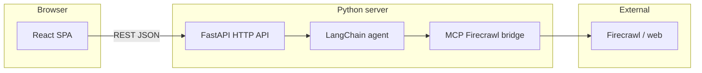

## Companion documents

| File | Role |
|------|------|
| [`GENERAL_DETAILED_PROJECT_REPORT.md`](./GENERAL_DETAILED_PROJECT_REPORT.md) | Detailed **frontend-only** technical report (architecture, HTTP client, state machine, UI, markdown/Mermaid pipeline, build, limitations, merge checklist). Combine with your **backend** detailed report, then fold the result into this thesis-oriented summary. |

# Thesis project report: Agentic Crawler ecosystem

This document is written for **human thesis writing** and for **downstream LLM use** (e.g. Claude). It separates **facts verified in this repository**, **behavior described for the Python backend** (not stored in this repo), and **placeholders** you must complete.

---

## 0. How to use this file with an LLM (read first)

Copy the following block into your LLM system prompt or as the first user message when working on the thesis:

```text
You are helping write an academic thesis about a software project called "Agentic Crawler."

Ground rules:
1. Treat sections marked "VERIFIED (this repo)" as authoritative for the React frontend.
2. Treat sections marked "DOCUMENTED (backend spec)" as the intended backend design; the backend source may live elsewhere — do not invent file paths for Python code unless the user provides them.
3. Sections marked "AUTHOR MUST FILL" contain deliberate gaps; ask the user for missing empirical results, citations, and institutional wording rather than fabricating them.
4. Prefer precise terminology from the Glossary (Section 12).
5. When proposing thesis structure, map claims to evidence: architecture diagrams, API contracts, user flows, limitations, evaluation metrics.
6. Do not claim peer-reviewed sources exist unless the user supplies DOIs or bibliographic data.
```

---

## 1. Executive summary (template)

**One paragraph (AUTHOR MUST FILL):** State the research problem, the role of LLM agents and web crawling in your solution, and what you built (backend HTTP API + React client). Mention evaluation if you have run experiments.

**Factual anchor (short):** The **browser client** in this repository is a **JSON-oriented consumer** of a **FastAPI** service. It implements chat UI, session persistence, markdown rendering (including Mermaid diagrams), observability side panels (health, stats, saved paths), and error handling aligned with a non-streaming agent API.

---

## 2. Problem statement and motivation (AUTHOR MUST FILL)

Use prompts:

- What gap does **agentic web analysis** address compared to manual auditing or static crawlers?
- Who is the intended user (researcher, developer, content owner)?
- What are **success criteria** (accuracy, coverage, latency, cost, reproducibility)?

**Non-binding hypotheses** (replace with your own):

- H1: An LLM-orchestrated crawl can produce **structured narratives** (summary, sitemap mental model, user flows) faster than manual exploration for medium-sized sites.
- H2: **Server-side** execution of tools and API keys reduces client attack surface versus browser-based scraping extensions.

---

## 3. System overview

### 3.1 High-level architecture



**Legend:**

- **React SPA (VERIFIED):** This repo.
- **FastAPI + LangChain + MCP + Firecrawl (DOCUMENTED):** Described in project specification; implementation not in this workspace unless you add it.

### 3.2 Trust boundaries (important for thesis "security / privacy" sections)

| Asset | Where it lives | Exposed to browser? |
|-------|----------------|---------------------|
| Crawl/scrape API keys, LLM keys | Server | **No** (by design) |
| `session_id` (conversation key) | Server memory/store + client copy | UUID string in browser storage |
| Saved reports / tool JSON dumps | Server filesystem | Paths returned in JSON; **no download endpoint assumed** in spec |
| User natural language prompts | Client → Server | Yes (over HTTPS in production) |

---

## 4. Backend API — DOCUMENTED (backend spec)

> **Source of truth:** Your written specification for the Python service. Adjust paths or fields if your implementation differs.

### 4.1 Endpoints (normative summary)

| Method | Path | Role |
|--------|------|------|
| POST | `/api/chat` | Main agent turn: user message in, full reply when complete (**no streaming**). |
| POST | `/api/session/clear` | Drop server-side history for a `session_id`. |
| GET | `/api/reports` | List saved report file paths (filesystem paths on server). |
| GET | `/api/outputs` | List saved tool-output file paths. |
| GET | `/api/stats` | Aggregate execution / cache statistics (shape implementation-defined). |
| GET | `/api/health` | `{ status, ready }` — readiness includes MCP/agent connectivity. |

### 4.2 Chat request / response (logical schema)

**Request (JSON):**

```json
{
  "message": "string",
  "session_id": "optional UUID string"
}
```

**Response (JSON, conceptual):**

```json
{
  "session_id": "string",
  "assistant_text": "markdown string",
  "tool_events": [
    {
      "name": "string",
      "args": {},
      "cached": true,
      "duration_seconds": 0.0,
      "output": {},
      "saved_path": "string"
    }
  ],
  "error": "string or omitted",
  "report_saved_path": "string or omitted"
}
```

**Thesis-relevant API properties:**

- **Non-streaming completion:** UX implication — long-running crawls block the HTTP request; the client must show **loading state** and may render **tool_events after the fact** (no live token stream in spec).
- **503 semantics:** When `ready` is false, chat may fail; client should surface this (this repo handles 503 in `postChat`).

### 4.3 CORS

- Configurable server-side (`CORS_ORIGINS`).
- Local dev example: allow `http://localhost:5173` (Vite default) or `*`.

---

## 5. Frontend implementation — VERIFIED (this repo)

### 5.1 Technology stack

| Layer | Choice | Version (package.json) |
|-------|--------|-------------------------|
| UI library | React | ^19.2.4 |
| Build | Vite | ^5.4.11 |
| Language | TypeScript | ~5.9.3 |
| Markdown | `react-markdown` + `remark-gfm` | ^10.1.0 / ^4.0.1 |
| Diagrams | `mermaid` | ^11.13.0 |

### 5.2 Session persistence

- **Storage:** `localStorage`
- **Key:** `agentic-crawler-session-id` (constant `SESSION_STORAGE_KEY` in `src/config.ts`)
- **Behavior:**
  - First message may omit `session_id` until the server returns one; subsequent messages include it.
  - **Clear & new ID:** calls `POST /api/session/clear` with the previous id, then generates a new client UUID and stores it.
  - **Forget session:** removes stored id and omits `session_id` on next send until the server assigns a new one.

### 5.3 UX features mapped to API

| UX element | Implementation note |
|------------|---------------------|
| Chat transcript | User + assistant bubbles; assistant content = markdown |
| Loading | Shown during `POST /api/chat`; send disabled |
| Mermaid | Fenced code blocks with language `mermaid` rendered via Mermaid; parse errors fall back to preformatted source |
| Tool transparency | Collapsible "Activity" panel listing `tool_events` |
| Report path banner | Shown when `report_saved_path` is present |
| Health | Polled every 15s + manual refresh; warns when `ready === false` |
| Stats / lists | `GET /api/stats`, `/api/reports`, `/api/outputs` with manual refresh; list JSON normalized if wrapped in common keys |

### 5.4 Source file map (frontend)

```
src/
  App.tsx                 — Main layout, state, chat flow, side panels
  App.css                 — Layout and component styles
  main.tsx                — React root
  index.css               — Global theme variables
  config.ts               — `VITE_API_BASE_URL`, session key
  api/
    types.ts              — `ChatRequest`, `ChatResponse`, `ToolEvent`, `HealthResponse`
    client.ts             — fetch wrappers, list normalization, error detail parsing
  components/
    MarkdownMessage.tsx   — GFM markdown + custom `pre` for Mermaid
    MermaidBlock.tsx      — Mermaid render with fallback
    ToolEventsPanel.tsx   — Collapsible tool event inspector
```

### 5.5 Configuration

- **Environment variable:** `VITE_API_BASE_URL` (no trailing slash); default `http://127.0.0.1:8000`
- **Example file:** `.env.example` in repository root

---

## 6. Agent behavior (conceptual) — DOCUMENTED + AUTHOR MUST FILL

**From specification:** The agent uses **LangChain** and **Firecrawl** (via **MCP** on the server) to crawl, map, and scrape sites; outputs include markdown answers, optional **Mermaid** user-flow diagrams, sitemap-style descriptions, and optional **persisted reports** on disk.

**You should add (thesis-grade detail):**

- Concrete **tool names** exposed to the model (if stable).
- **Prompting strategy** (system prompt structure, URL extraction, safety rules).
- **Model provider** and **version** (e.g. OpenAI / Anthropic / local) — cite only what you actually used.
- **Token/cost** interpretation of `/api/stats` fields once you inspect real payloads.

---

## 7. Limitations (strong thesis material)

Use as a checklist; mark each as **observed** or **inferred**:

| Limitation | Why it matters |
|------------|----------------|
| No response streaming | Long wall-clock waits; timeout risk on proxies; poor perceived latency. |
| Server filesystem paths in UI | End users cannot fetch files unless a download API is added. |
| Crawl correctness | Depends on Firecrawl, site structure, robots.txt, auth walls, rate limits. |
| LLM hallucination risk | Summaries and diagrams may misrepresent site behavior; need validation methodology. |
| Session storage in browser | `localStorage` is not secret; UUID is not authentication. |
| MCP single point of failure | `ready: false` blocks or degrades service. |

---

## 8. Evaluation plan (AUTHOR MUST FILL)

Provide **datasets**, **metrics**, and **protocols**. Example skeleton:

- **Tasks:** e.g. summarize N sites, extract primary user journeys, compare to human baseline.
- **Metrics:** time to answer, tool call count, cache hit rate (from `/api/stats`), qualitative rubric for diagram usefulness.
- **Baselines:** manual exploration, non-agentic crawler + static summarization, or ablation without Firecrawl.
- **Threats to validity:** changing websites, API rate limits, non-reproducible LLM outputs (temperature, prompt drift).

---

## 9. Ethics, compliance, and legal (AUTHOR MUST FILL)

Thesis reviewers often expect explicit treatment of:

- **Terms of service** and **robots.txt** for crawled domains.
- **Personal data** (if any) in pages or logs.
- **Responsible disclosure** if the tool finds vulnerabilities.
- **Energy / cost** of LLM + crawl operations (brief sustainability note).

---

## 10. Related work pointers (AUTHOR MUST FILL — with real citations)

Structured slots (replace with your bibliography entries):

1. **LLM agents + tools:** [Citation]
2. **Web scraping / structured extraction:** [Citation]
3. **MCP (Model Context Protocol):** [Citation or official spec URL + access date]
4. **LangChain-style agent frameworks:** [Citation]

---

## 11. Build and run commands — VERIFIED (this repo)

```bash
cd frontend
npm install
cp .env.example .env   # optional
npm run dev            # Vite dev server (default http://localhost:5173)
npm run build
npm run lint
```

**Production note:** Serve `dist/` behind HTTPS; align `VITE_API_BASE_URL` with the deployed API; configure backend `CORS_ORIGINS`.

---

## 12. Glossary (use consistently in thesis + LLM sessions)

| Term | Definition |
|------|------------|
| Agentic Crawler | The overall system: LLM agent orchestrating web crawl/scrape tools over HTTP. |
| Session | Server-side conversation state keyed by `session_id`. |
| Tool event | One agent tool invocation record (name, args, timing, output, optional saved path). |
| MCP | Model Context Protocol; server-side bridge in spec between agent and Firecrawl. |
| Firecrawl | Third-party crawl/scrape capability (as integrated on server). |
| Non-streaming API | Entire assistant turn returned in one HTTP response. |

---

## 13. Suggested thesis chapter mapping (editable)

| Chapter | This project supplies |
|---------|------------------------|
| Introduction / motivation | Sections 1–2 + your domain story |
| Requirements | API contract (Section 4), UX goals (Section 5.3) |
| Architecture | Section 3 + diagrams |
| Implementation | Section 5 (frontend verified); backend when you document repo |
| Security / privacy | Section 3.2, 7 |
| Evaluation | Section 8 + your results |
| Conclusion | Limitations + future work (streaming UI, file download API, auth) |

---

## 14. Versioning and provenance

| Artifact | Note |
|----------|------|
| This report | Created to support thesis writing and LLM-assisted drafting; not a peer-reviewed source. |
| Frontend code | See `git log` when repository is under version control. |

---

## 15. Open questions for the author (answer before heavy LLM drafting)

1. Official **thesis title** (HU / EN)?
2. Is the **Python backend** in a separate repository? Path or name?
3. **Exact LLM** and **Firecrawl** configuration used in experiments?
4. Do you have **quantitative results** (tables) ready to paste?
5. Any **institutional thesis template** constraints (word limits, required sections)?

---

*End of report.*
